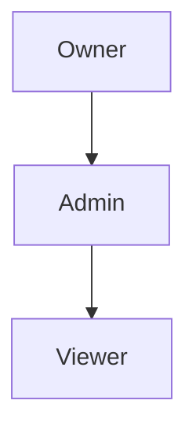
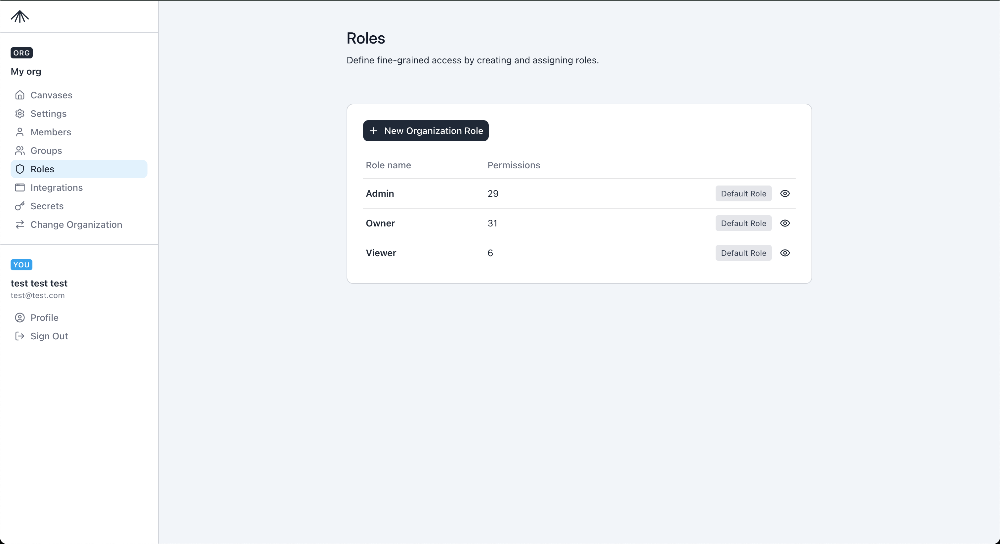
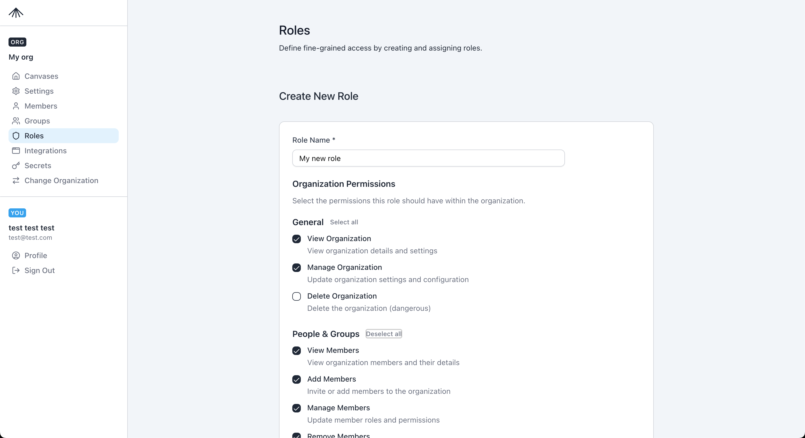
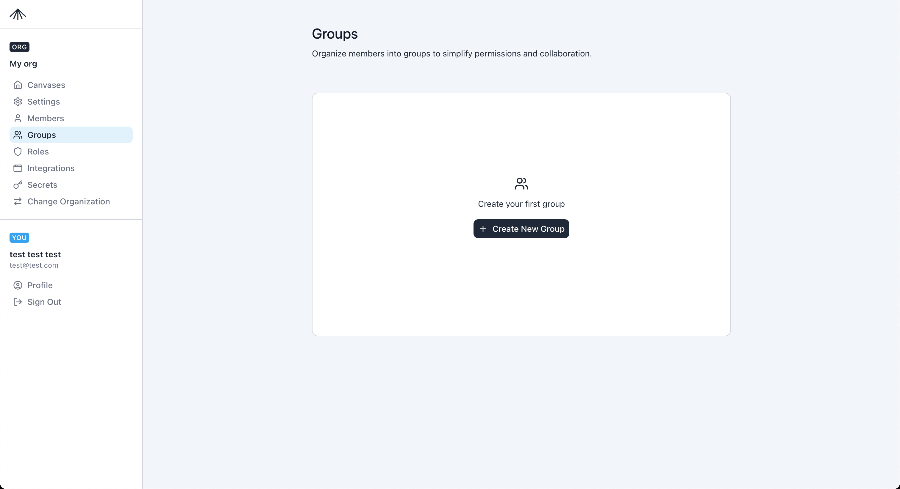
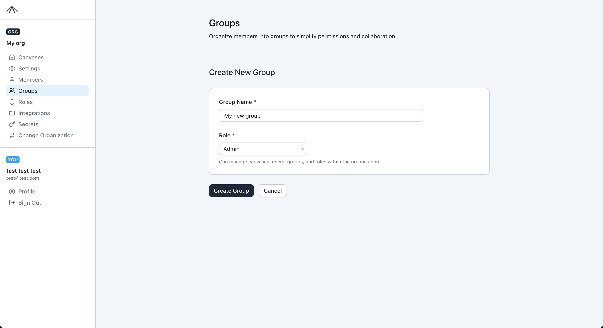
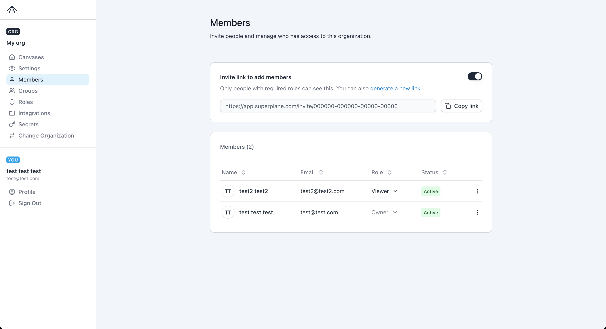

**Overview**
SuperPlane uses organization-scoped role-based access control (RBAC) to decide who can do what in an organization. Today, RBAC is only defined at the organization level (there are no project-level roles).

**RBAC Sections**
- [Roles](#roles)
- [Groups](#groups)
- [Members](#members)
- [Permissions Reference](#permissions-reference)

**Role Model**
- A member has one direct organization role at a time. Assigning a new role replaces the previous direct role.
- Group membership can add additional roles. Effective permissions are the union of direct role, group roles,
  and inherited roles.
- Default roles are `Owner`, `Admin`, and `Viewer`. They are read-only in the UI.
- To change the permissions of a default role, create a custom role and assign it instead.

**Role Inheritance**

**Default Roles**
| Role | Inherits | Summary |
| --- | --- | --- |
| Owner | Admin | Full admin access plus manage organization settings and deletion. |
| Admin | Viewer | Manage members, groups, roles, canvases, integrations, secrets, and custom components (if enabled). |
| Viewer | - | Read-only access to org settings, roles, groups, members, canvases, and custom components (if enabled). |

New members are assigned the `Viewer` role by default.

**Default Role Permissions**
Viewer permissions:
- `org.read`
- `roles.read`
- `groups.read`
- `members.read`
- `canvases.read`

Admin permissions:
- All Viewer permissions.
- `canvases.create`
- `canvases.update`
- `canvases.delete`
- `members.create`
- `members.update`
- `members.delete`
- `groups.create`
- `groups.update`
- `groups.delete`
- `integrations.create`
- `integrations.read`
- `integrations.update`
- `integrations.delete`
- `secrets.create`
- `secrets.read`
- `secrets.update`
- `secrets.delete`
- `roles.create`
- `roles.update`
- `roles.delete`

Owner permissions:
- All Admin permissions.
- `org.update`
- `org.delete`

**Permissions Reference**
Permissions are defined as resource/action pairs (for example, `members.create`). Use this list when
building custom roles.

**General**
- `org.read` - View organization details and settings.
- `org.update` - Update organization settings and configuration.
- `org.delete` - Delete the organization (dangerous).

**People & Groups**
- `members.read` - View organization members and their details.
- `members.create` - Invite or add members to the organization.
- `members.update` - Update member roles and permissions.
- `members.delete` - Remove members from the organization.
- `groups.read` - View organization groups and their members.
- `groups.create` - Create new groups within the organization.
- `groups.update` - Update group settings and membership.
- `groups.delete` - Delete groups from the organization.

**Roles & Permissions**
- `roles.read` - View organization roles and their permissions.
- `roles.create` - Create new roles within the organization.
- `roles.update` - Update role permissions and settings.
- `roles.delete` - Delete roles from the organization.

**Canvases**
- `canvases.read` - View organization canvases.
- `canvases.create` - Create new canvases within the organization.
- `canvases.update` - Update canvas settings and configuration.
- `canvases.delete` - Delete canvases from the organization.

**Integrations**
- `integrations.read` - View organization integrations.
- `integrations.create` - Create new integrations.
- `integrations.update` - Update integration settings and configuration.
- `integrations.delete` - Delete integrations from the organization.

**Secrets**
- `secrets.read` - View organization secrets.
- `secrets.create` - Create new secrets.
- `secrets.update` - Update secrets.
- `secrets.delete` - Delete secrets from the organization

**Roles**
Use **Organization Settings > Roles** to review roles and create custom roles.
- Default roles are marked as **Default Role** and are read-only.
- Custom roles can be created, edited, and deleted if you have `roles.*` permissions.

The Create Role page lets you pick permissions by category.

**Groups**
Groups map to a single role. When a user is added to a group, they inherit that role in addition to any direct role assignment.
- Create groups in **Organization Settings > Groups**.
- Change a group role from the Groups list; all group members inherit the new role immediately.

**Members**
The Members page is where you assign a member's direct role and manage invite links.
- New members start as `Viewer` by default.
- Assigning a role replaces the previous direct role.
- You must keep at least one `Owner` in the organization.

