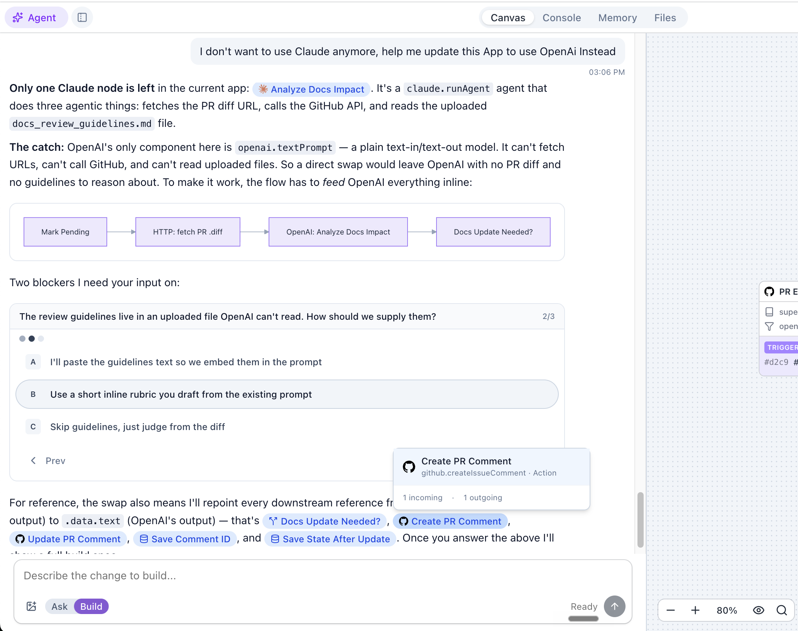
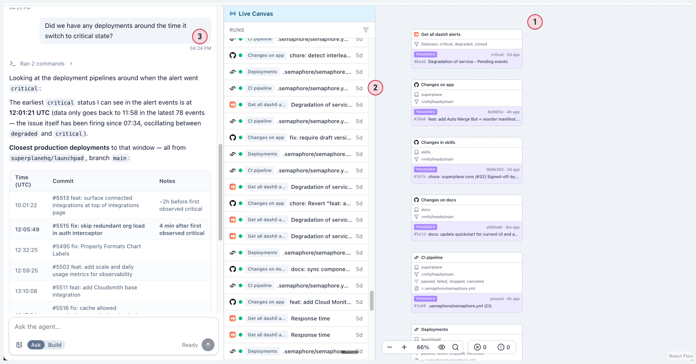
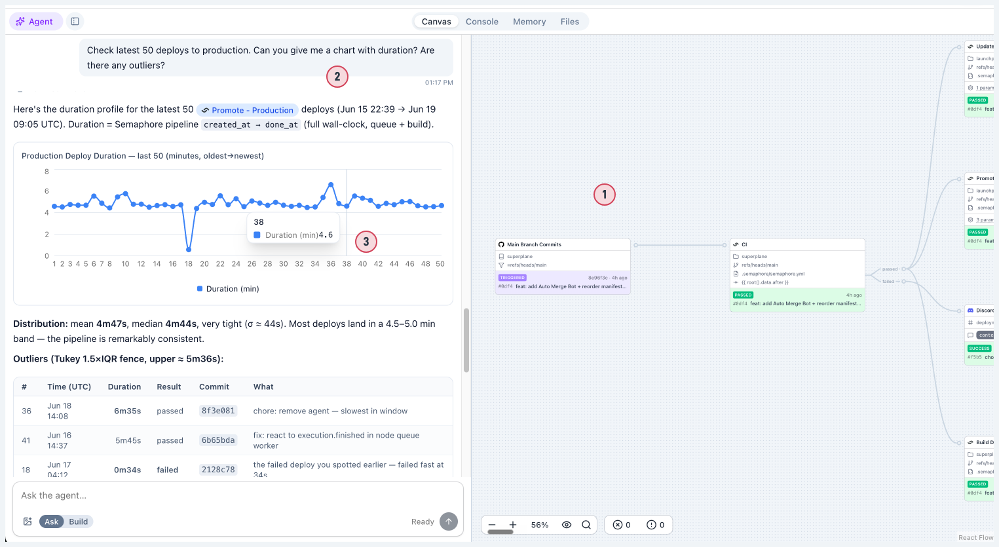

SuperPlane includes a built-in AI agent that helps you build workflows and dashboards, debug executions, and manage repository files. The agent is context-aware, persistent, and operates safely within your app's permission boundaries.

## Agent modes

The agent adapts to your current task using two modes:

### Build mode

Build mode gives the agent write access to your app. Use it to design workflows from scratch, or install an existing app and chat with the agent to adjust it to your use case.

**What the agent can do in Build mode:**

- Add, remove, and configure canvas nodes and connections
- Swap components (e.g., replace Claude with OpenAI) and rewire downstream references
- Create and edit console panels (numbers, charts, tables, row actions)
- Write and update files in the app repository (scripts, AGENTS.md, README)
- Stage, commit, and publish canvas and console changes
- Set up integrations and wire them to nodes

**Example prompts:**

- "Add a Slack notification after the deploy step"
- "Create a console dashboard with a table of recent deployments"
- "Add an If node that checks if the health check passed"
- "Write a setup script that installs Node.js and nginx"
- "Wire the GitHub trigger to the new approval node"

**Best practices:**

- Start with a clear description of what you want to build. The agent works best when it understands the full picture before starting.
- For complex workflows, let the agent present a **rubric** first. Review the plan before approving.
- Use **@mentions** to reference specific nodes: type `@` followed by the node name so the agent targets the right component.
- Build incrementally. Add a few nodes, test, then extend — rather than asking for the entire workflow at once.
- Review the agent's draft before publishing. The agent works on drafts only and cannot publish directly.

### Ask mode

Ask mode is read-only. The agent can inspect your app's state, analyze runs, and answer questions without making changes.

1. **Add trigger components** that record events from your external tools (alerts, deployments, CI pipelines)
2. **Wait for data to collect** — each trigger event creates a run with its payload
3. **Ask the agent** to analyze and cross-reference events from multiple sources

**What the agent can do in Ask mode:**

- Inspect recent runs and execution history
- Read node payloads and configuration
- Check canvas memory values
- Analyze failed executions and suggest fixes
- Explain how the workflow works
- Review queued events

**Example prompts:**

- "Why did the last deploy fail?"
- "Show me the payload from the Get PR Details node"
- "What's in the preview-envs memory namespace?"
- "How does the approval flow work?"
- "Are there any queued events on the SSH setup node?"
- "Check the latest 50 deploys to production. Can you give me a chart with duration? Are there any outliers?"

The agent can render charts, tables, and statistical analysis inline in the chat:

1. **Set up a workflow** through SuperPlane (e.g., a deployment pipeline)
2. **Ask the agent** for analysis — duration trends, outliers, optimization opportunities
3. **The agent renders** charts, tables, and statistical breakdowns directly in the conversation

**Best practices:**

- Switch to Ask mode when you are debugging or monitoring. It prevents accidental changes.
- Be specific about which run or node you are asking about. The agent can inspect any recent run, but referencing the right one helps.
- Use Ask mode to understand an unfamiliar app before making changes in Build mode.
- Add trigger components that record events from your external tools (alerts, deployments, CI pipelines). Once the data is collected, Ask mode can cross-reference events across sources — for example, finding which deployments happened around the time an alert went critical.

## Chat persistence and streaming

Each app has a single, permanent chat session. Your conversation history persists across browser reloads and sessions.

When you send a message, the agent's responses stream back asynchronously. You can continue working on the canvas while the agent processes your request.

### Interrupting the agent

If the agent is heading in the wrong direction or taking too long, click **Stop** to halt its current operation and return control to you.

## Rubrics

For complex tasks, the agent uses a **rubric** to confirm its plan before building.

When you ask the agent to build something broad (like "add health checking"), it first asks clarifying questions. Once it has enough context, it presents a rubric — a specification of what it intends to build, including the flow, components, and integrations.

Review the rubric and either request changes or click **Start Building** to approve. The agent does not modify your canvas until you approve.

## Node mentions

Reference canvas nodes in your messages by typing `@` followed by the node name. This gives the agent the exact node ID and context, so it targets the correct component when answering questions or making updates.

## Tools and capabilities

The agent has built-in tools to interact with your app:

**Repository file tools** — list, read, write, and delete files in your app's repository. Stage changes to a draft branch and commit them.

**Canvas and console tools** — modify `canvas.yaml` and `console.yaml` configurations directly. Add nodes, update connections, and build dashboard panels.

**Runtime read tools** — inspect recent runs, read event payloads, check execution queues, and read memory values. Available in both Build and Ask modes.

## Permissions and safety

The agent operates within strict boundaries:

- **RBAC enforcement**: The agent shares your session's permissions. It cannot do anything you cannot do. See [RBAC](/security/access-control).
- **Canvas isolation**: The agent is bound to its parent app. It cannot read or modify other apps.
- **Drafts only**: The agent updates draft versions only. It cannot publish changes directly.
- **File safety**: The agent cannot access system paths or traverse outside the repository workspace.

## Limits

- **Query limits**: Runtime reads and file listings are paginated (up to 40 items per query).
- **Context management**: Long conversations are automatically truncated to fit the provider's context window, preserving the most recent messages.

## Provider setup

The built-in agent is powered by Anthropic's Claude. To enable the agent in a self-hosted deployment, configure these environment variables:

- `ANTHROPIC_API_KEY`: Your Anthropic API key.
- `ANTHROPIC_AGENT_ID`: The ID of your managed agent.
- `ANTHROPIC_ENVIRONMENT_ID`: The ID of your Anthropic environment.

If these variables are not set, the agent interface is disabled.
