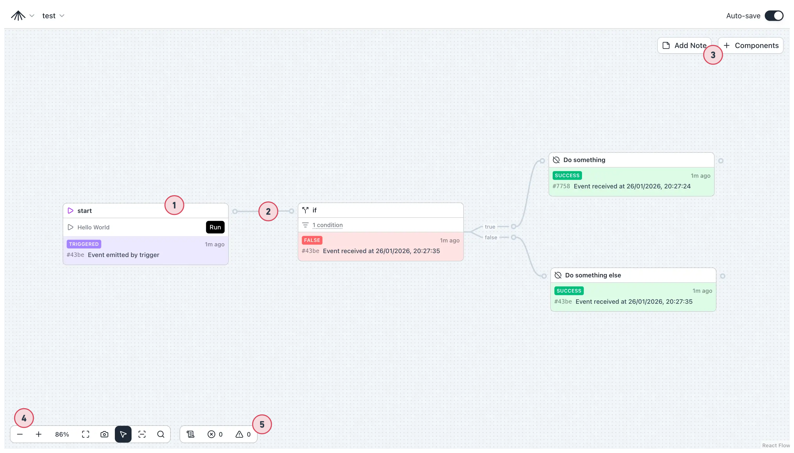
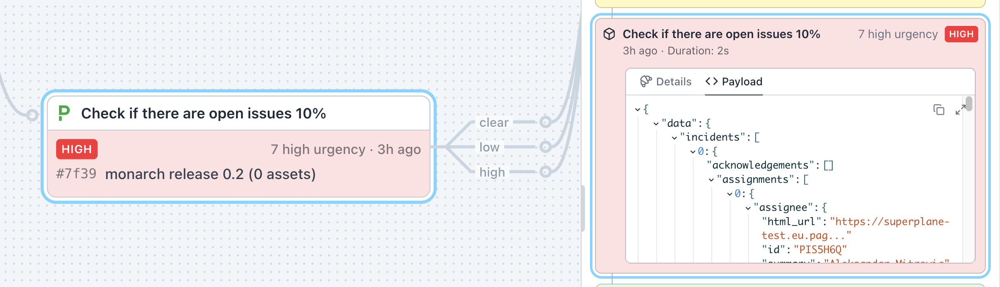
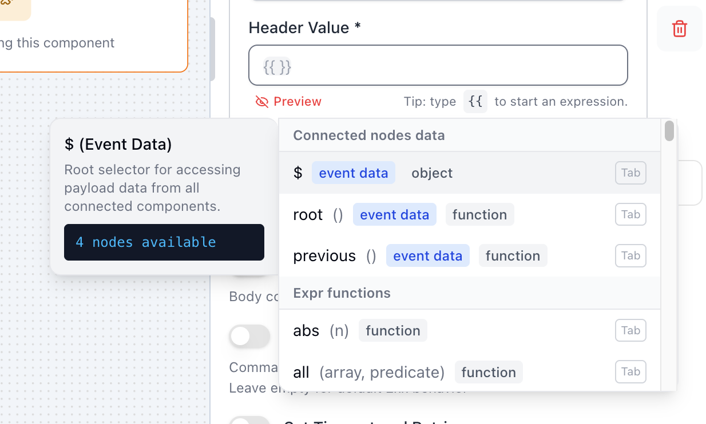
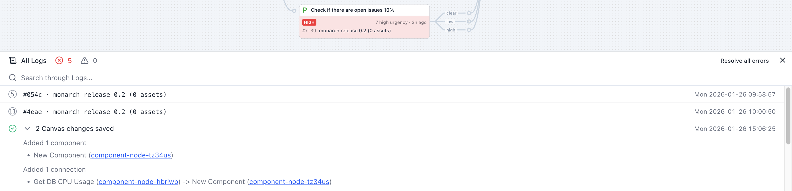

A **canvas** is the workspace where you design and run workflows in SuperPlane. It's a visual
graph of nodes connected by subscriptions that define how events flow between steps.

Think of a canvas as:

- **A workspace** for designing workflows visually
- **A live system** where multiple runs can execute simultaneously
- **A graph** that defines all possible execution paths
- **A unified view** of your automation logic

A single canvas can represent multiple possible workflows, depending on which paths events take
through the graph. The canvas provides a place to model complex, event-driven workflows that span
multiple tools, wait for human input, and run over extended periods of time.

## Visual Layout

The canvas page displays nodes, connections, status indicators, and provides tools for building and
managing your workflows.



The canvas consists of:

1. **Nodes** — Instances of components, the core building blocks. See [Component Nodes](/concepts/component-nodes).
2. **Connections** — Indicate which node listens to which. See [Data Flow](/concepts/data-flow).
3. **Add new elements** — Add annotations and new components to the canvas.
4. **Helper toolbar** — Navigation tools, select/pan mode, search.
5. **Console** — Warnings, errors, and log of changes and events.

## Editing and Updating Canvases

You can edit and update canvases in two ways:

### Visual Editor (UI)

Use the visual editor to build and modify canvases interactively:

- **Add nodes**: Drag components from the component palette onto the canvas
- **Connect nodes**: Create subscriptions by connecting nodes together
- **Configure nodes**: Click on any node to edit its configuration
- **Delete elements**: Remove nodes or connections as needed

Changes are saved automatically, and you can see your workflow update in real-time.

### Command Line (CLI)

Use the SuperPlane CLI to manage canvases programmatically:

```sh
# Export a canvas
superplane get canvas <canvas_name> > my_canvas.yaml

# Edit the YAML file
# ... make your changes ...

# Apply updates
superplane update -f my_canvas.yaml
```

## The Canvas Page

### Nodes and Connections

**Nodes** are instances of components. To add a node, click **"+ Components"** and drag onto the
canvas. **Connections** define how events flow between nodes — drag from a source node's output
channel to a target node.

Nodes show status badges (running, succeeded, failed) and key information from their latest
payload. For details on components, see [Component Nodes](/concepts/component-nodes).

### Payloads and Events

Every node emits a **payload** — JSON data containing the results of its execution. Click any node
and view the Payload tab to inspect it.



When configuring nodes, type `{{` in expression fields to access payload data from upstream nodes.



Use `$['Node Name'].field` to reference data from any connected node. See [Data Flow](/concepts/data-flow)
for more details.

### Workflows and Runs

A single canvas can express multiple workflows depending on which trigger fires and which paths
events take. **Multiple runs execute simultaneously** — the canvas updates in real-time as runs
execute, with each node showing its current or most recent status.

Click any node to view its run history. Select a run item to see the full run chain showing all
nodes that executed as part of that run.

### Console

The console tracks errors, warnings, and provides a log of all changes and events on the canvas.



- **Errors and warnings** — Count indicators show issues needing attention
- **Canvas changes** — Logs when components or connections are added, updated, or removed
- **Run details** — Execution logs for each run
- **Search** — Filter through logs to find specific events

## Best Practices

- **Organize logically**: Group related nodes together visually
- **Use clear node names**: Make it easy to understand what each node does
- **Test incrementally**: Build and test workflows step by step
- **Monitor the console**: Check for errors and review run history regularly

For more details on data flow, see [Data Flow](/concepts/data-flow). For component details, see [Component
Nodes](/concepts/component-nodes).
