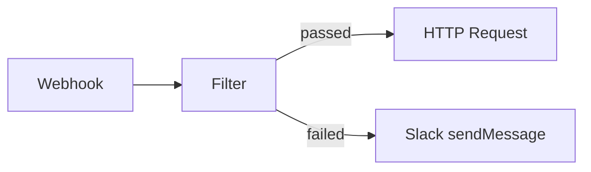

**Components** are the building blocks of SuperPlane workflows. Each component defines a specific
capability — whether it's listening for events, executing actions, or transforming data. When you add
a component to your canvas, it becomes a **node** that can receive events, perform work, and emit
payloads.

## What are Components?

A component is the "type" of a node. It defines:

- **What the node does**: The action it performs or the event it listens for
- **What configuration it needs**: Required and optional settings
- **What it emits**: The structure of the payload it produces
- **What output channels it supports**: Different paths based on outcomes

**Examples of components:**

- **Webhook**: Listens for incoming HTTP requests
- **GitHub onPush**: Listens for GitHub push events
- **Filter**: Evaluates conditions and routes events
- **HTTP Request**: Makes HTTP calls to external APIs
- **Slack sendMessage**: Sends messages to Slack channels

## Component Types

Components fall into two main categories:

### Triggers

**Trigger components** start workflow executions. They listen for external events or can be invoked
manually:

- **External events**: Webhooks, GitHub pushes, Slack mentions, scheduled times
- **Manual invocation**: Manual Run component lets you start workflows on demand
- **Event-driven**: They emit events when something happens externally

**Examples:** Webhook, Schedule, Manual Run, GitHub onPush, Slack onAppMention

### Actions

**Action components** execute operations in response to upstream events:

- **Subscribe to events**: They receive events from trigger nodes or other action nodes
- **Perform operations**: Call external APIs, transform data, route events, wait for input
- **Emit results**: Produce payloads that downstream nodes can use

**Examples:** HTTP Request, Filter, Approval, GitHub runWorkflow, Slack sendMessage

## Adding Components to Your Canvas

### From the UI

1. **Open your canvas** in the SuperPlane UI
2. **Click the add node button** or drag from the component palette
3. **Select a component** from the list of available components
4. **Place the node** on the canvas where you want it

The component is now a node on your canvas, ready to be configured and connected.

### From YAML

When defining your canvas in YAML, specify the component type for each node:

```yaml
nodes:
  - id: webhook-1
    component: webhook
    config:
      path: /webhook
  - id: filter-1
    component: filter
    config:
      expression: $['webhook-1'].data.method == "POST"
```

### Component Availability

Components are provided by **integrations**. SuperPlane includes:

- **Core components**: Built-in components like Webhook, Filter, HTTP Request
- **Integration components**: Components from integrations like GitHub, Slack, PagerDuty

To use integration components, you may need to configure authentication or connection settings for that
integration first.

## Configuring Components

Each component has its own configuration requirements. When you add a component to your canvas, you
need to configure it based on what it does.

### Configuration Fields

Component configurations typically include:

- **Required fields**: Settings that must be provided for the component to work
- **Optional fields**: Settings that customize behavior or provide additional context
- **Expression support**: Many fields support expressions using `{{ }}` syntax

### Example: Configuring a Filter Component

A Filter component needs an expression that evaluates to true or false:

```
$['GitHub onPush'].ref == "refs/heads/main"
```

### Example: Configuring an HTTP Request Component

An HTTP Request component needs:

- **URL**: Where to send the request
- **Method**: GET, POST, PUT, DELETE, etc.
- **Headers**: Optional HTTP headers
- **Body**: Optional request body (can use expressions)

```
URL: https://api.example.com/webhook
Method: POST
Body: {{toJSON($['Webhook'].data)}}
```

### Using Expressions in Configuration

Many component fields support expressions to make configurations dynamic:

- **Access payload data**: `$['Node Name'].field`
- **Transform values**: `lower($['Node Name'].text)`
- **Build strings**: `"Deployment of {{$['Release'].data.name}} started"`

See [Expressions](./expressions) for details on writing expressions.

## Updating Component Configuration

You can update a component's configuration at any time:

### In the UI

1. **Click on the node** you want to update
2. **Open the configuration panel** (usually in a sidebar)
3. **Edit the configuration fields**
4. **Save your changes**

The updated configuration applies to all future executions of that node.

### From YAML

1. **Export your canvas**: `superplane get canvas <canvas_name> > my_canvas.yaml`
2. **Edit the node configuration** in the YAML file
3. **Apply the changes**: `superplane update -f my_canvas.yaml`

### Configuration Updates and Running Workflows

- **Active runs**: Configuration changes don't affect runs that are already in progress
- **New runs**: All new runs use the updated configuration
- **No downtime**: You can update configurations without stopping the canvas

## Using Components in Workflows

### Creating Subscriptions

To connect components and create workflows, you create **subscriptions**:

1. **Select a source node**: The node that emits events
2. **Select a target node**: The node that should receive events
3. **Optionally specify a channel**: If the source has multiple output channels

**Example workflow:**



### Output Channels

Many components emit on multiple **output channels** to route events based on outcomes:

- **Filter**: `passed` or `failed` channels
- **GitHub runWorkflow**: `passed` or `failed` channels
- **Approval**: `approved` or `rejected` channels

Subscribe to specific channels to create conditional workflows:

- Subscribe to `passed` to continue on success
- Subscribe to `failed` to handle errors
- Subscribe to multiple channels to create parallel paths

### Accessing Component Outputs

Downstream nodes can access payloads from upstream components using expressions:

```
$['Component Name'].field
$['Component Name'].nested.field
```

Each component's documentation describes the structure of its payload, so you know what fields are
available.

## Component Documentation

Each component has detailed documentation that covers:

- **What it does**: Purpose and use cases
- **Configuration options**: All available settings
- **Output structure**: What the payload looks like
- **Output channels**: Available channels and when they're used
- **Examples**: Common usage patterns

Browse the [Components](/components) section to see all available components and their
documentation.

## Best Practices

When working with components:

- **Choose the right component**: Understand what each component does before using it
- **Configure thoughtfully**: Provide clear, meaningful configuration values
- **Use expressions**: Make configurations dynamic by referencing upstream data
- **Name nodes clearly**: Give nodes descriptive names that indicate their purpose
- **Document complex logic**: Use node descriptions for non-obvious configurations
- **Test configurations**: Verify component behavior with simple test cases first

For more details on how components connect and how data flows between them, see [Data Flow](./data-flow). For information about the canvas where you work with components, see [Canvas Overview](./canvas-overview).
