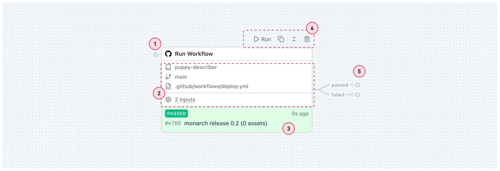
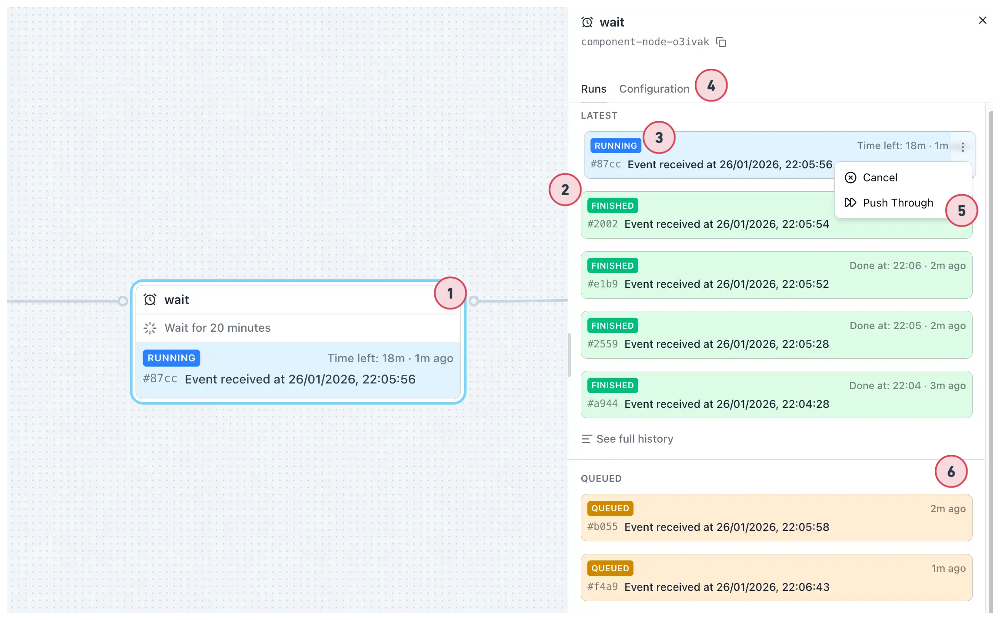
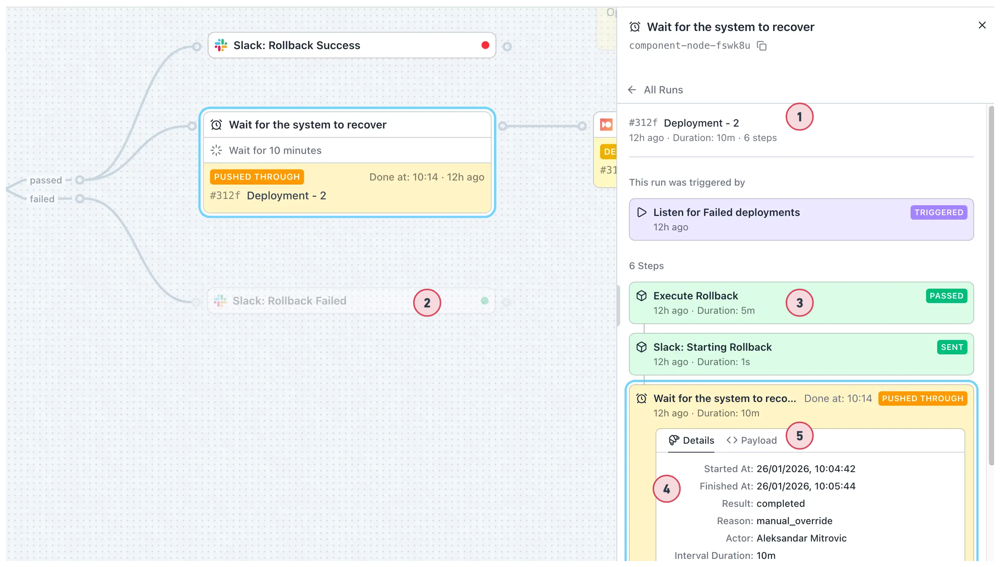

**Components** are available building blocks that define capabilities in SuperPlane. A **component node**
is one instance of a component on the Canvas. When you add a component to your canvas, it becomes a
node that can receive events, perform work, and emit payloads.

## Components vs Component Nodes

- **Component**: The building block definition — what it does, what configuration it needs, what it
  emits
- **Component Node**: A single instance of a component placed on your canvas with specific
  configuration

Think of it like this: a component is like a blueprint, and a component node is the actual building
you construct from that blueprint.

## Component Types

There are two types of components:

### Trigger Components

**Trigger components** start workflow executions. They listen for external events or can be invoked
manually.

**Examples:** Webhook, Schedule, Manual Run, GitHub onPush, Slack onAppMention

### Action Components

**Action components** execute operations in response to upstream events. They subscribe to events,
perform operations, and emit payloads for downstream nodes.

**Examples:** HTTP Request, Filter, Approval, GitHub runWorkflow, Slack sendMessage

## Adding Component Nodes to the Canvas

New component nodes can be added to the Canvas in two ways:

### From the Components Menu

1. Click the **"+ Components"** button in the top right of the canvas
2. Select a component from the list of available components
3. Drag it onto the canvas where you want it

The component is now a node on your canvas, ready to be configured and connected.

### From Output Channels

You can also drag an output channel from an existing node to an empty space on the canvas. This
creates a new component node and automatically subscribes it to that output channel, making it
faster to model workflows.

## Node Overview on Canvas

Each component node on the canvas displays key information and provides interactive elements:

1. **Input channel** — Drag to subscribe to events from other nodes (Action nodes only).
2. **Configuration overview** — Quick summary of key settings for this node.
3. **Latest Run Item** — Shows the last run executed or event emitted.
4. **Action menu** — On hover: manually emit, copy, collapse/expand, or delete.
5. **Output channels** — Subscribe other nodes or drag to create new components.

## Component Node Sidebar

Clicking on a component node selects it and opens a component node sidebar.

1. **Click to open** — You can click on a node to open the sidebar.
2. **Resizable sidebar** — Sidebar is resizable and contains node details.
3. **Latest runs section** — Recent executions with event ID, timestamp, and status.
4. **Configuration tab** — Settings for setting up and updating the node's configuration. Each
   component has its own configuration requirements (required fields, optional fields, and expression
   support using `{{ }}` syntax).
5. **Action menu for run item** — Cancel or push through running items.
6. **Queue** — Items waiting to execute (FIFO order).

See [Expressions](./expressions) for details on writing expressions.

## Single Run Chain

Select a run from the list to see the full chain of nodes it went through.

1. **Run chain** — Shows all nodes in the run with current node preselected.
2. **Dimmed nodes** — Nodes not included in the run are dimmed on the canvas.
3. **Expandable details** — Expand other nodes in the chain to view their payloads.
4. **Details tab** — Execution info: start/finish time, result, duration.
5. **Payload tab** — The data this node emitted for downstream nodes.

## Component Availability

Components are provided by **integrations**. SuperPlane includes:

- **Core components**: Built-in components like Webhook, Filter, HTTP Request
- **Integration components**: Components from integrations like GitHub, Slack, PagerDuty

To use integration components, you may need to configure authentication or connection settings for
that integration first.

Browse the [Components](/components) section to see all available components and their
documentation.

## Best Practices

When working with component nodes:

- **Choose the right component**: Understand what each component does before using it
- **Use expressions**: Make configurations dynamic by referencing upstream data
- **Name nodes clearly**: Use descriptive names that indicate purpose
- **Test incrementally**: Verify component behavior before building complex workflows
- **Monitor run history**: Check execution history to understand behavior and debug issues

For more details on how component nodes connect and how data flows between them, see [Data
Flow](./data-flow). For information about the canvas where you work with component nodes, see
[Canvas](./canvas).
