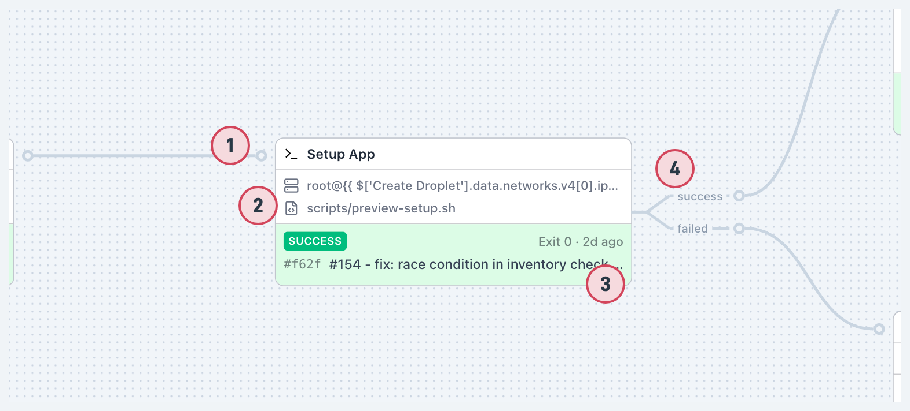
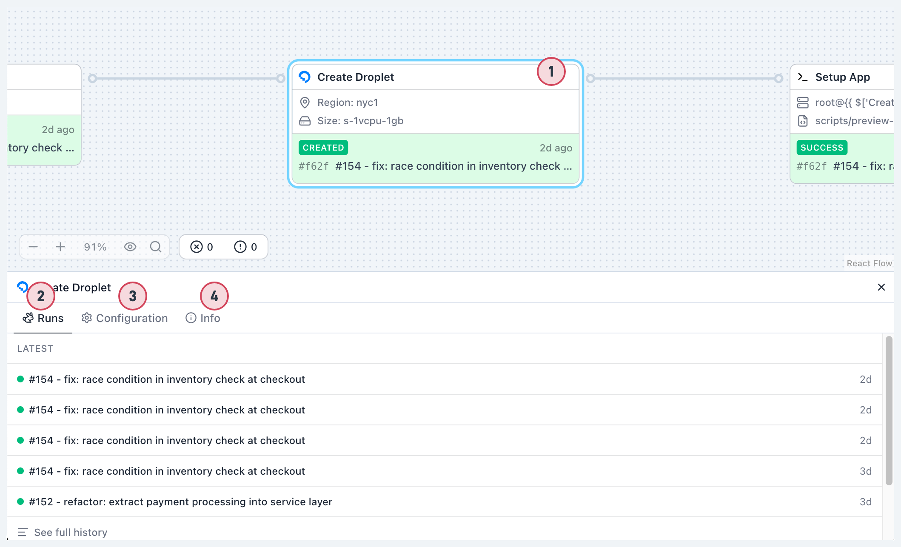
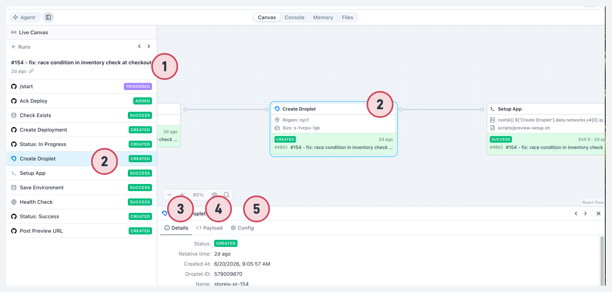

**Components** are available building blocks that define capabilities in SuperPlane. A **component node**
is one instance of a component on the canvas. When you add a component to your canvas, it becomes a
node that can receive events, perform work, and emit payloads.

## Components vs Component Nodes

- **Component**: The building block definition — what it does, what configuration it needs, what it
  emits
- **Component Node**: A single instance of a component placed on your canvas with specific
  configuration

Think of it like this: a component is the reusable definition, and a component node is one concrete
instance with its own settings and name.

## Component Types

There are two types of **executable** components (nodes that participate in runs):

### Trigger Components

**Trigger components** start workflow executions. They listen for external events or can be invoked
manually.

**Examples:** Webhook, Schedule, Manual Run, GitHub onPush, Slack onAppMention

### Action Components

**Action components** execute operations in response to upstream events. They subscribe to events,
perform operations, and emit payloads for downstream nodes.

**Examples:** HTTP Request, Filter, Approval, GitHub runWorkflow, Slack sendMessage

## Adding component nodes to the canvas

You must be in **Edit** mode to add or modify nodes. Click **Edit** in the canvas header to enter edit mode.

New component nodes can be added in two ways:

### From the Components Menu

1. Click the **"+ Components"** button in the top right of the canvas
2. Select a component from the list of available components
3. Drag it onto the canvas where you want it

The component is now a node on your canvas, ready to be configured and connected.

### From Output Channels

You can also drag an output channel from an existing node to an empty space on the canvas. This
creates a new component node and automatically subscribes it to that output channel, making it
faster to model workflows.

## Node overview on canvas

Each component node on the canvas displays key information and provides interactive elements:

1. **Input channel** — Drag to subscribe to events from other nodes (action nodes only).
2. **Configuration overview** — Quick summary of key settings for this node.
3. **Latest run item** — Shows the last execution that passed through this node, with its status and timestamp.
4. **Output channels** — Named output channels (e.g., `success`, `failed`). Subscribe other nodes or drag to create new components.

## Component node inspector

Click on a component node to select it and open the inspector panel at the bottom of the canvas.

1. **Selected node** — The node is highlighted on the canvas. The bottom panel shows its details.
2. **Runs** — Recent executions with run ID, PR reference, and timestamp. Click a run item to inspect it. Running or waiting items can be cancelled or pushed through from the action menu.
3. **Configuration** — Node settings. Fields support [expressions](/concepts/expressions) for dynamic values.
4. **Info** — Component documentation and usage reference.

## Inspecting a run

Select a run from the **Runs** tab or from the [Runs sidebar](/concepts/runs) to inspect it. The canvas highlights the path the run took, dimming nodes that were not part of the execution.

1. **Selected run** — The sidebar shows the full execution chain with every node and its status.
2. **Node selection** — Click a node in the sidebar or directly on the canvas to inspect its execution.
3. **Details** — Execution summary: status, timestamps, and component-specific output fields.
4. **Payload** — The data this node emitted for downstream nodes.
5. **Config** — Resolved configuration snapshot at execution time (same as `$['Node Name'].config` in expressions). See [Expressions](/concepts/expressions).

## Component Availability

Components are provided by **integrations**. SuperPlane includes:

- **Core components**: Built-in components like Webhook, Filter, HTTP Request
- **Integration components**: Components from integrations like GitHub, Slack, PagerDuty

To use integration components, you may need to configure authentication or connection settings for
that integration first.

Browse the [Components](/components/core) section to see all available components and their
documentation.

## Best Practices

When working with component nodes:

- **Choose the right component**: Understand what each component does before using it
- **Use expressions**: Make configurations dynamic by referencing upstream data
- **Name nodes clearly**: Use descriptive names that indicate purpose
- **Test incrementally**: Verify component behavior before building complex workflows
- **Monitor run history**: Check execution history to understand behavior and debug issues

For more details on how component nodes connect and how data flows between them, see [Data
Flow](/concepts/data-flow). For information about the canvas where you work with component nodes, see
[Canvas](/concepts/canvas).
