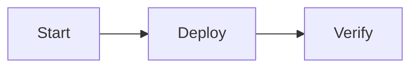

The [console](/concepts/console) is a grid of **widgets** (also called panels). This
page covers each widget type: when to use it, the fields it accepts, and a worked
YAML example.

Tables, charts, numbers, and the markdown/HTML variable system all read from the
same [data sources](/concepts/console/data-sources). Templates and conditional
expressions follow the rules in [Expressions &
CEL](/concepts/console/expressions).

## Widgets at a glance

| Type | When to use it |
| --- | --- |
| [Markdown](#markdown) | Runbooks, notes, status copy, links. Alerts, sections, Mermaid, chips, and live variables. |
| [HTML](#html) | Custom layout with scoped CSS and Tailwind utilities, with the same variables. |
| [Node](#node) | Pin one canvas node — status + optional Run button. |
| [Key Nodes](#key-nodes) | Pin several nodes with a short purpose line for each. |
| [Table](#table) | Rows from memory, executions, or runs — with filters, formatting, and row actions. |
| [Chart](#chart) | Bar, stacked-bar, line, area, or donut chart over the same data. |
| [Number](#number) | One KPI, multiple side-by-side KPIs, or a combined aggregate. |

## Markdown

Use the **Markdown** widget for the prose parts of a console: runbooks,
playbook links, status explanations, deployment notes. The same markdown
renderer powers **Files** `.md` previews, so authoring features below work in
both places.

{/* TODO(image): screenshot of a markdown widget rendering a runbook with a status badge */}

**Authoring features:**

- GitHub-flavored markdown (tables, task lists, strikethrough, autolinks).
- Soft line breaks (one Enter is a `<br>`, not two paragraphs).
- [GitHub-style alerts](#alerts) for callouts (`NOTE`, `TIP`, `IMPORTANT`,
  `WARNING`, `CAUTION`).
- [Collapsible sections](#sections) with `[!SECTION]` (preferred) or raw
  `<details>` / `<summary>`.
- [Mermaid diagrams](#mermaid-diagrams) from fenced `mermaid` code blocks, with
  expand and pan/zoom in the fullscreen view.
- [Canvas chips](#canvas-chips) via `node:` and `integration:` links.
- **Safe-by-default raw HTML.** Inline `<script>`, event handlers (`onclick`,
  `onerror`, …), and any tag outside the allowlist are stripped at render time. The
  only raw tags added on top of the default allowlist are `<details>` and
  `<summary>` (plus the `open` attribute).

### Alerts

GitHub alert blockquotes render with SuperPlane chrome (accent bar + label).
Put the marker on its own line inside the quote:

```markdown
> [!NOTE]
> Rollouts pause when the canary error rate exceeds 2%.

> [!TIP]
> Prefer linking the deploy node with `[Deploy](node:http-request-deploy-a1b2c3)`.

> [!IMPORTANT]
> Production deploys require two approvals.

> [!WARNING]
> Do not re-run failed migrations without checking the run payload.

> [!CAUTION]
> This action deletes the preview environment.
```

Supported markers: `NOTE`, `TIP`, `IMPORTANT`, `WARNING`, `CAUTION`. Unknown
markers (for example `[!TODO]`) stay as plain blockquotes.

### Sections

Use `[!SECTION]` for collapsible runbook sections. Sections start collapsed;
click the header to expand. Nested sections are supported, and a parent shows
a count of its **direct** nested sections next to the title.

```markdown
> [!SECTION] Troubleshooting
> Flush the cache, then re-run the health check.
>
> > [!SECTION] Cache
> > Prefer the **Flush cache** node over manual Redis commands.
```

#### Presets and colors

You pick color (and icon) with a **named preset** in the marker — there is no
free-form color value. Syntax: `[!SECTION:preset] Title`.

| Preset | Accent | Typical use |
| --- | --- | --- |
| `overview` | Slate | What this app/workflow is for |
| `setup` | Sky | Prerequisites, secrets, first-time config |
| `runbook` | Emerald | Step-by-step operating procedure |
| `run` | Blue | Promote / release / go-live steps |
| `troubleshoot` | Amber | Failures, checks, how to unblock |
| `agent` | Violet | Notes and standing instructions for agents |
| `integrations` | Cyan | Connected integrations and wiring |
| `group` | Slate (muted) | Nested grouping when no stronger preset fits |

```markdown
> [!SECTION:runbook] Production promote
> Require two approvals, then run the canary.

> [!SECTION:agent] Agent notes
> Prefer `node:` chips when linking canvas steps.
```

Root sections without a preset use `runbook`. Nested sections without a preset
use `group`.

#### Trailing meta

Optional text after a middle dot (` · `) in the title appears on the right of
the header. Use it for SuperPlane context such as environment, owner, or step
count.

```markdown
> [!SECTION:run] Promote after green canary · prod
> 1. Confirm health checks passed.
> 2. Promote with `[Deploy](node:http-request-deploy-a1b2c3)`.

> [!SECTION:group] Preview cleanup · on-call
> Tear down with `[Delete preview](node:digitalocean-delete-droplet-f9e8d7)`.
```

The title is the text before the separator; the trailing text is everything
after it.

Raw HTML `<details>` / `<summary>` still works when you need a pre-expanded
block (`<details open>`) or markup that is not a blockquote:

```markdown
<details open>
<summary>Troubleshooting</summary>

- Flush the cache.
- Roll back via the **Rollback** node panel.

</details>
```

The body inside `<details>` is still parsed as markdown.

### Mermaid diagrams

Fenced `mermaid` code blocks render as diagrams. Use the expand control to
open a fullscreen view with fit-to-viewport, zoom, and pan:

````markdown

````

Other fenced languages keep the shared code-block chrome (including expand
where available).

### Canvas chips

Special link schemes become interactive chips when canvas context is available
(console markdown and Files on a canvas).

#### Node chips

Use `node:<node-id>` — the value after `node:` is the canvas **node id**, not
the display name. The markdown link text is the label shown on the chip.

```markdown
[Deploy](node:http-request-deploy-a1b2c3)
```

Node ids look like `{component}-{name}-{6-char}` (for example
`http-request-deploy-a1b2c3`). Find one by selecting the node on the canvas —
the id appears in the node panel and in the URL as `?node=<id>`.

Hover a chip for node details; click it to select and fit that node on the live
canvas (or on the run canvas while inspecting a run).

#### Integration chips

Use `integration:<ref>`:

| Ref | Meaning |
| --- | --- |
| Integration name (for example `github`) | Chip for that integration type — connect/create when none is linked yet. |
| Connected instance UUID | Chip for a specific connected integration instance. |

```markdown
[GitHub](integration:github)
[Prod Slack](integration:791ee6d1-4c2a-4f0b-9c1d-0a1b2c3d4e5f)
```

Regular `http(s)`, relative, `mailto:`, and fragment links stay normal anchors.

### Variables

## HTML

Use the **HTML** widget when markdown isn't expressive enough — custom badges,
multi-column layouts, status callouts that need precise styling. HTML widgets share
the markdown variable system, so anything you can do with `{{ }}` in markdown works
here too.

{/* TODO(image): screenshot of an HTML widget rendering a styled release card */}

The editor is split into a code pane (monospace textarea for the HTML), a live
preview, and the variables manager on the right. **Cmd/Ctrl + Enter** saves;
**Escape** cancels.

### Safety policy

The body is sanitized at render time, after variables are interpolated and before
the result is inserted into the DOM. The pipeline is:

```text
interpolate variables -> sanitize allow-list -> scope <style> blocks -> render
```

In practice:

- **Allowed tags** — structural (`div`, `section`, `article`, `header`, `footer`,
  `main`, `aside`, `nav`, `p`, `h1`–`h6`, `blockquote`, `pre`, `hr`, `br`), inline
  text (`span`, `strong`, `em`, `code`, `kbd`, `samp`, `var`, `abbr`, `cite`,
  `dfn`, `q`, `time`, `data`, and similar), lists (`ul`, `ol`, `li`, `dl`, `dt`,
  `dd`), tables, links and images (`a`, `img`, `figure`, `figcaption`),
  interactive (`details`, `summary`), and `<style>` (scoped — see below).
- **Allowed attributes** — `class`, `style`, `id`, `href`, `src`, `srcset`,
  `title`, `alt`, `width`, `height`, `colspan`, `rowspan`, `open`, `lang`, `dir`,
  `role`, `tabindex`, `name`, plus ARIA. Every `on*` event handler is stripped.
- **Forbidden tags** — `script`, `iframe`, `object`, `embed`, `link`, `meta`,
  `form` and all form controls, `audio`, `video`, `canvas`, `math`, `svg`. These
  are removed even if the allow-list says otherwise.
- **URL allow-list** — `href`, `src`, and `srcset` accept `http(s)`, `mailto:`,
  `tel:`, fragments (`#…`), and relative paths. `javascript:` and `data:` URLs
  never survive.
- **External images load.** `` works for `http(s)` URLs. Cross-origin
  fetches leak the canvas URL via the `Referer` header and can act as tracking
  pixels — embed images only from sources you trust.

### Scoped `<style>` blocks

`<style>` blocks are preserved, but every selector is rewritten with a
panel-specific attribute prefix so styles cannot leak out of the widget. Rules
referencing `url(...)`, `@import`, and unknown at-rules (`@keyframes`,
`@font-face`, …) are dropped. `@media` and `@supports` are recursed into so
scoping still applies.

### Tailwind utilities

A curated Tailwind safelist is bundled into the docs site and made available to
HTML widgets: layout (display, flex, grid), spacing, sizing, typography, the full
color palette (`text-*`, `bg-*`, `border-*` for every default shade), borders,
rounding, shadow, opacity, overflow, positioning, z-index, cursor, and
transitions.

Interactive variants are safelisted where they matter most:

- `hover:` and `focus:` for color (`text-*`, `bg-*`, `border-*`), display, text
  decoration (`underline`, `line-through`, `no-underline`), `shadow*`, and
  `opacity-*`.
- Hover/focus on sizing, spacing, and typography size families is not safelisted.

The `dark:` variant is not safelisted — pick colors that work in both light and
dark themes rather than relying on the variant.

### Authoring example

```yaml
- id: release-card
  type: html
  content:
    title: "{{ release.service }}"
    body: |
      <style>
        .badge {
          display: inline-block;
          padding: 2px 6px;
          border-radius: 4px;
          font-size: 11px;
          font-weight: 600;
        }
        .badge-passed { background: #dcfce7; color: #166534; }
        .badge-failed { background: #fee2e2; color: #991b1b; }
      </style>
      <div class="flex flex-col gap-2 text-sm">
        <div class="flex items-center gap-2">
          <strong>{{ release.service }}</strong>
          <span class="badge badge-{{ lastRun.status }}">{{ lastRun.status }}</span>
        </div>
        <p class="text-slate-600">Triggered by {{ lastRun.nodeName }}.</p>
      </div>
    variables:
      - name: release
        source:
          kind: memory
          namespace: releases
      - name: lastRun
        source:
          kind: run
          select: latest
```

### Content fields

| Field | Required | Meaning |
| --- | --- | --- |
| `title` | no | Card header. Supports `{{ }}` templates. |
| `body` | no | HTML body. Supports `{{ }}` templates. Sanitized at render time. |
| `variables` | no | Same shape as markdown variables. |

## Node

Use the **Node** widget to pin one canvas node to the console — current status,
last run timestamp, and an optional **Run** button to trigger it manually.

{/* TODO(image): screenshot of a Node widget showing status and a Run button */}

Common uses:

- Pin the "Deploy to production" trigger so on-call engineers can promote a
  release without leaving the console.
- Pin a "Tear down preview" trigger as a one-click cleanup.

### Content fields

| Field | Required | Meaning |
| --- | --- | --- |
| `title` | no | Card header. Defaults to the resolved node name. |
| `node` | yes | Canvas node id or name. |
| `showRun` | no | When `true`, surface a manual **Run** button. Still requires `canvases:update`. |
| `triggerName` | no | Start template name when the trigger exposes multiple templates. |

### Example

```yaml
- id: deploy-prod
  type: node
  content:
    title: Deploy to production
    node: deploy-production
    showRun: true
```

## Key Nodes

The **Key Nodes** widget (panel `type: nodes`) renders several pinned nodes in a
single card, each with an optional purpose line. Use it for "entry and exit
points" summaries — the trigger, the deployment, the smoke test, and the cleanup
— instead of stamping out one Node widget per row.

{/* TODO(image): screenshot of a Key Nodes widget for a preview-environment workflow */}

### Content fields

| Field | Required | Meaning |
| --- | --- | --- |
| `title` | no | Card header. |
| `nodes` | yes | Array of pinned nodes. May be empty on a fresh panel; the card shows a "configure me" hint until you add at least one. |

Each entry in `nodes` accepts:

| Field | Required | Meaning |
| --- | --- | --- |
| `node` | yes | Canvas node id or name. |
| `label` | no | Override for the displayed row name. Falls back to the resolved node name. |
| `description` | no | Short purpose line under the row name. |
| `showRun` | no | When `true`, surface a manual **Run** button. Still gated by permissions. |
| `triggerName` | no | Start template name when the trigger exposes multiple templates. |

### Example

```yaml
- id: pr-workflow
  type: nodes
  content:
    title: Key Nodes
    nodes:
      - node: pr-opened
        description: GitHub PR trigger that boots a new environment.
      - node: create-droplet
        description: Provisions the DigitalOcean droplet.
      - node: health-check
        description: Confirms the preview is responsive.
      - node: delete-droplet
        label: Tear Down
        description: Releases the droplet when the PR closes.
        showRun: true
```

## Table

The **Table** widget is the most configurable widget type. It renders rows from a
[data source](/concepts/console/data-sources) — memory, executions, or runs —
with column formatting, structured filters, and optional row actions.

{/* TODO(image): screenshot of a memory-backed Table widget with status badges and a Destroy row action */}

A memory-backed table is the recommended pattern for ephemeral-environment
consoles (one row per PR, one row per preview, one row per incident).

### Example

```yaml
type: table
content:
  dataSource:
    kind: memory
    namespace: environments
  render:
    kind: table
    columns:
      - field: pr_number
        label: PR
      - field: status
        label: Health
        format: status
      - field: created_at
        label: Uptime
        format: relative
    where:
      - field: status
        op: neq
        value: destroyed
    rowActions:
      - kind: trigger
        label: Destroy
        node: start
        template: destroy
        variant: danger
        confirm: "Destroy PR #{{ pr_number }}?"
        show: 'status == "running"'
        payload:
          issue.number: "{{ pr_number }}"
```

The editor scans live canvas memory and suggests namespaces and field names. The
column dropdown, filter inputs, sort field input, and row-action payload chips all
work off a field catalog derived from the data source — see [Field
catalogs](/concepts/console/data-sources#field-catalogs).

### Columns

Each column needs a non-empty `field`. The other fields are optional:

| Field | Meaning |
| --- | --- |
| `label` | Header text. Falls back to `field`. |
| `format` | Display format. See the table below. |
| `show` | Row expression controlling whether the cell is visible. |
| `href` | Link template for `link`-formatted columns. |

Column `field` accepts a direct dot path (`status`, `payload.user_id`,
`rootEvent.customName`) or a `{{ CEL }}` template. When the typed value matches a
known catalog field, the column's `label` and `format` autofill so picking from
the dropdown stays one click.

**Format values:**

| Format | Renders as |
| --- | --- |
| `text` | Plain string (default). |
| `number` | Locale-aware numeric, with thousands separators. |
| `percent` | Locale-aware percentage. |
| `date` | Date only, in the viewer's local timezone. |
| `datetime` | Date and time, in the viewer's local timezone. |
| `relative` | "5 minutes ago" / "in 2 days". |
| `duration` | Human duration. Always interprets input as **milliseconds** — convert from seconds in CEL (`{{ seconds * 1000 }}`) first. |
| `status` | Colored pill: green for `passed`/`ready`/`active`, red for `failed`, amber for `pending`, sky for `running`. |
| `badge` | Alias for `status`. |
| `code` | Monospace text. |
| `link` | Renders as a hyperlink. Requires `href`. |

### Structured filters

`render.where` is an AND list. Each filter has a `field`, an `op`, and (for most
operators) a `value`:

| Operator | Meaning |
| --- | --- |
| `eq` / `neq` | String equality / inequality. |
| `contains` / `not_contains` | Substring match. |
| `gt` / `lt` | Numeric comparison. |
| `exists` / `not_exists` | Non-empty / empty field. |

Use structured filters when the condition is simple enough to validate. Use
`{{ CEL }}` in `show` when you need expression power (see
[Expressions](/concepts/console/expressions)).

### Row actions

Row actions add per-row buttons that invoke a **trigger node** on the canvas. They
don't call HTTP Request nodes directly — they fire the trigger, and downstream
steps run because of that, the same as any manual run.

| Field | Meaning |
| --- | --- |
| `kind` | Must be `trigger`. |
| `node` | Trigger node id or name. Required. |
| `hook` | Trigger hook name. Defaults to `run`. |
| `template` | Start template name when the trigger supports templates. |
| `label` | Button label. Defaults to `Run`. |
| `payload` | Map of dot paths to literals or `{{ CEL }}` templates, merged into trigger parameters. |
| `confirm` | Optional confirmation dialog text. Supports `{{ }}` interpolation. |
| `show` | Expression controlling per-row visibility. |
| `variant` | `default`, `primary`, or `danger`. |
| `icon` | `play`, `stop`, `trash`, `refresh`, or `external-link`. |

When a row action fires, the widget interpolates the `confirm` text, builds the
trigger parameters from the row data and the action `payload`, then calls the
trigger hook. Console queries refresh once the call returns.

## Chart

The **Chart** widget renders the same data sources as Table, grouped into chart
points. Pick a chart type, an `xField` (the bucket key), and one or more series.

{/* TODO(image): screenshot of a stacked-bar chart and a donut chart side by side */}

### Chart types

| `type` | Shape |
| --- | --- |
| `bar` | One bar per `xField` bucket, with each series rendered side-by-side. |
| `stacked-bar` | One bar per bucket, with series stacked on top of each other. With a single series, this is visually identical to `bar`. |
| `line` | One line per series across `xField`. |
| `area` | Same as `line` with filled area below. |
| `donut` | One slice per distinct `xField` value, valued by the first series. |

Rows that share the same resolved `xField` value are merged into a single chart
point. If a series omits `field`, the chart **counts** rows per bucket. If
`field` is set, the chart **sums** numeric values from that field across each
bucket. Non-numeric values are ignored.

### Example

```yaml
render:
  kind: chart
  type: bar
  xField: service
  series:
    - field: cost
      label: Cost
      format: number
      prefix: "$"
  legend: auto
```

### Pivoting long-format rows with `seriesField`

When the data source emits one row per `(X, series)` combination — e.g. one row
per `(date, service)` cost line — set `seriesField` to pivot those rows into one
series per distinct value:

```yaml
render:
  kind: chart
  type: stacked-bar
  xField: date
  seriesField: service
  series:
    - field: cost_usd
      label: Cost
      prefix: "$"
```

When `seriesField` is set, the chart sums the numeric `field` of the **first**
configured series per `(xField, seriesField)` bucket. Additional series entries
are ignored for shaping — colors and order come from the data.

### Series formatting

Each series accepts optional display fields used by the hover tooltip and donut
value rows:

- `format` — `text`, `number`, `percent`, or `duration`. Defaults to `number`.
  `duration` always interprets input as **milliseconds**.
- `prefix` — literal string rendered before the value (for example `"$"`).
- `suffix` — literal string rendered after the value (for example `" MWh"`).

Tooltips show the category in the header and one row per series with
`label — prefix{value}suffix`. Donut tooltips append the slice's share of the
total (for example `ec2 — $1,200 (52%)`).

### Legend

`render.legend` controls legend visibility:

- `auto` (default) — visible for donut charts or when 2+ series are configured.
- `show` — always visible (useful for a single-series chart that needs a label).
- `hide` — never rendered.

### Axis formatting

Cartesian charts (`bar`, `stacked-bar`, `line`, `area`) expose three optional
axis fields:

- `xFormat` — display format applied to X-axis tick labels **and the hover
  tooltip header**. Uses the same vocabulary as column `format` (`text`,
  `number`, `percent`, `date`, `datetime`, `relative`, `duration`). Set
  `xFormat: date` when `xField` is a raw timestamp, rather than wrapping it in a
  CEL expression.
- `yLabel` — Y-axis title (for example `USD`, `Errors / day`).
- `yFormat` — display format for Y-axis tick labels (`number`, `percent`,
  `duration`). Falls back to a locale-aware numeric default with thousands
  separators above 1k. A series `format` only affects tooltip values — configure
  `yFormat` to match it on the axis itself.

```yaml
render:
  kind: chart
  type: bar
  xField: createdAt
  xFormat: date
  yLabel: USD
  yFormat: number
  series:
    - field: cost
      label: Cost
      format: number
      prefix: "$"
```

Donut charts ignore `xFormat`, `yLabel`, and `yFormat` — no axes are rendered.

## Number

The **Number** widget aggregates rows into a KPI. It has three modes: a single
value, multiple values side-by-side, or one value combined across several memory
namespaces.

{/* TODO(image): screenshot of a Number widget with a single KPI and a multi-number card */}

### Aggregations

| Aggregation | What it returns |
| --- | --- |
| `count` | Number of rows. Doesn't need a `field`. |
| `sum` | Sum of `field` across rows. |
| `avg` | Mean of `field` across rows. |
| `min` / `max` | Min / max of `field`. |
| `first` / `last` | First / last value of `field` in source order. |

All aggregations except `count` require a non-empty `field`.

### Display symbols

`render.prefix` and `render.suffix` wrap the formatted value with a literal
string. Use them for currency or units — `prefix: "R$"`, `suffix: " MWh"`. They
apply after `render.format`, so locale-aware formatting (`number`, `percent`,
`duration`) is preserved. When the aggregate is null/empty, the widget renders an
em-dash placeholder without the symbols.

```yaml
render:
  kind: number
  aggregation: sum
  field: cost
  format: number
  prefix: "R$"
```

### Composite memory sources

Use a composite memory source when the contributing namespaces have different
schemas — for example "sum of cost" in one namespace and "count of tests" in
another. Each entry aggregates its own namespace; the partials are then merged
with `combine`.

```yaml
type: number
content:
  dataSource:
    kind: memory
    combine: sum
    sources:
      - namespace: expenses
        aggregation: sum
        field: cost
      - namespace: tests
        aggregation: count
  render:
    kind: number
    format: number
    prefix: "R$"
```

**Rules:**

- `sources` is a non-empty array. Each entry needs a non-empty `namespace`, an
  `aggregation`, and a `field` (unless `aggregation` is `count`). An optional
  `fieldPath` flattens the entry the same way the single-namespace memory source
  does.
- `combine` is one of `sum`, `min`, `max`, or `avg`. `sum` is the default.
- When `sources` is set, `render.aggregation` and `render.field` must be absent —
  the per-source configuration is the source of truth.
- Partial values that resolve to `null` are skipped during combine. The panel
  renders the em-dash placeholder only when every partial is null.
- `avg` is an unweighted mean of the available partials, not a row-weighted
  average across namespaces. Use `sum` when row-level math matters.
- Sparklines are only available in single-source mode.

The Number form exposes a **Single / Multiple memory sources / Multiple numbers**
toggle that seeds the new mode from whatever is currently configured.

### Multi-number mode

A Number panel can also render **multiple independently-configured KPIs in one
card**. Each metric has its own data source, aggregation, field, label, format,
prefix/suffix, and optional sparkline. The metrics lay out in a flex row that
wraps when the panel is narrow.

```yaml
type: number
content:
  title: Pipeline KPIs
  metrics:
    - dataSource:
        kind: runs
      render:
        kind: number
        aggregation: count
        label: Total runs
    - dataSource:
        kind: memory
        namespace: costs
      render:
        kind: number
        aggregation: sum
        field: cost
        label: Total cost
        format: number
        prefix: "R$"
```

**Rules:**

- `metrics` is a non-empty array. When present, top-level `dataSource` and
  `render` are not used and are not required.
- Each metric's `dataSource` must be a single-source `memory` / `executions` /
  `runs` shape — the composite (`sources` + `combine`) shape is not allowed
  inside a metric.
- Each metric's `render.kind` is `number`. `render.aggregation` is required;
  `render.field` is required for aggregations other than `count`.
- Use `render.label` as the metric's name (it renders above the value).

The three modes — single value, composite-combined, and multi-number — are
disjoint. A Number panel is exactly one of them at a time.

## Where to go next

- [Data sources](/concepts/console/data-sources) — what each source returns,
  field catalogs, and the variable system used by markdown and HTML widgets.
- [Expressions & CEL](/concepts/console/expressions) — `{{ }}` templates, the
  builtins catalog, and how console expressions differ from canvas
  [Expr](/concepts/expressions).
