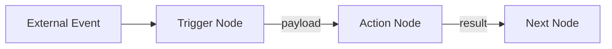
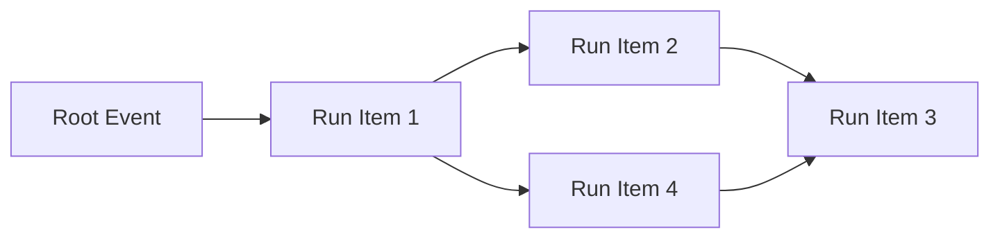
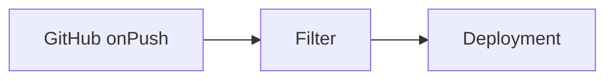
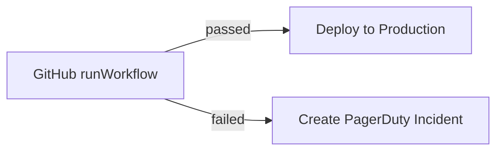

SuperPlane is an event-driven workflow engine. Every node on the canvas emits a payload, and other nodes
subscribe to these events to create workflows. This model enables flexible, composable automation pipelines.

## How It Works

When an external event occurs (like a GitHub push), it triggers a node on your canvas. That node processes
the event, emits a payload, and downstream nodes that subscribe to it receive the data and continue the chain.



Each node in the workflow:

1. **Receives** an event from its subscribed sources
2. **Processes** the event (executes an action, transforms data, etc.)
3. **Emits** a payload for downstream nodes

As the workflow executes, payloads from each node accumulate into a message chain. Any node can access
data from any upstream node in this chain using expressions.

## Runs and Run Items

Understanding how SuperPlane tracks execution helps when working with data flow.

### Run Items

A **run item** is a single execution within a single node:

- For **trigger nodes**: a single received event (e.g., a GitHub push event)
- For **action nodes**: a single execution (e.g., running a GitHub workflow)

Each run item produces a payload that downstream nodes can access.

### Runs

A **run** is a collection of run items and the dependencies between them. It represents a complete workflow
execution from start to finish.

- Starts with a **root event** — the first event that triggered the workflow (usually from a trigger node)
- Grows as the workflow executes and each node adds its run item to the chain
- Tracks the full execution history and data flow



## The Message Chain

As a run executes, each node's output is added to a **message chain**. This chain is accessible via the `$`
variable — think of it as a message bus that streams all outputs to your current node.

### How It Works

Consider this workflow:



When the workflow executes, each node adds its output to `$`:

```json
{
  "GitHub onPush": { "ref": "refs/heads/main", "commit": "abc123" },
  "Filter": { "passed": true },
  "Deployment": { "status": "success", "url": "https://app.example.com" }
}
```

From the Deployment node, you can access any upstream output:

```
$['GitHub onPush'].ref           // "refs/heads/main"
$['Filter'].passed               // true
```

You can also use `root()` to access the original event that started the run, and `previous()` to access
the immediate upstream node. See the [Expressions](#expressions) section for details.

## Exploring Runs on the Canvas

The workflow you see on the canvas is dynamic — it's not a single run, but a live view where multiple runs
can execute simultaneously.

### Node Status

Each node on the canvas shows a quick overview of its current or most recent run item.


### Run History

Click on any node to open the sidebar. The sidebar shows the run history — all executions or events that
have passed through this node, along with each execution's result.


### Run Chain

Click on any item in the run history to see the full run chain. This shows all run items from all nodes
that executed as part of that particular run.


### Inspecting Run Items

In the run chain view, the node you were inspecting is preselected. You can click on any other run item
in the chain to explore its details and payload.


## Payloads

Every node emits a **payload** — a JSON object containing data from its execution.

### Trigger Nodes

Trigger nodes listen to external resources and emit the event data as their payload.

- Connect to external systems via webhooks or integrations
- Emit events when something happens externally
- Payload contains the raw event data from the external system

**Examples:** GitHub onPush, GitHub onRelease, Slack onAppMention

### Action Nodes

Action nodes execute operations and emit execution results as their payload.

- Subscribe to events from upstream nodes
- Execute operations on external systems
- Payload contains execution results and any returned data

**Examples:** GitHub runWorkflow, Slack sendMessage, HTTP request

### Output Channels

Nodes can emit through one or multiple output channels. Channels let you route data based on different
outcomes.

| Component | Channels | Description |
|-----------|----------|-------------|
| GitHub runWorkflow | `passed`, `failed` | Routes based on workflow success or failure |
| Approval | `approved`, `rejected` | Routes based on approval decision |
| Merge | `success`, `stopped`, `timeout` | Routes based on merge outcome |
| Dash0 listIssues | `clear`, `degraded`, `critical` | Routes based on issue severity |
| PagerDuty listIncidents | `clear`, `low`, `high` | Routes based on incident urgency |

**Example: Pass/Fail Routing**



Subscribe to the `passed` channel to continue on success, or the `failed` channel to handle errors.

## Expressions

SuperPlane uses [Expr](https://expr-lang.org) for expressions. Expressions let you access payload data,
transform values, and evaluate conditions.

### Accessing Payload Data

Use `$['Node Name']` to access payload data from any upstream node in the message chain:

```
$['Node Name'].field
$['Node Name'].nested.field
$['Node Name'].array[0].value
```

**Examples:**

```
$['GitHub onPush'].ref                              // Branch ref
$['GitHub onPush'].head_commit.message              // Commit message
$['Deploy 10%'].workflow_run.html_url               // Workflow URL
```

### SuperPlane Functions

These functions are specific to SuperPlane workflows:

| Function | Description | Example |
|----------|-------------|---------|
| `root()` | Returns the root payload that started the run | `root().data.ref` |
| `previous()` | Returns payload from the immediate upstream node | `previous().data.status` |
| `previous(n)` | Walk n levels upstream | `previous(2).data.version` |

### Common Functions

Expr provides a rich set of built-in functions:

**String**
`lower()`, `upper()`, `trim()`, `split()`, `replace()`, `indexOf()`, `hasPrefix()`, `hasSuffix()`

**Array**
`filter()`, `map()`, `first()`, `last()`, `len()`, `any()`, `all()`, `count()`, `join()`

**Date**
`now()`, `date()`, `duration()` — with methods like `.Year()`, `.Month()`, `.Day()`, `.Hour()`

**Type Conversion**
`int()`, `float()`, `string()`, `toJSON()`, `fromJSON()`, `toBase64()`, `fromBase64()`

For the complete function reference, see the [Expr language documentation](https://expr-lang.org/docs/language-definition).

### Using Expressions in Configuration

Expressions can be used in component configuration fields using double curly braces:

**Dynamic message:**
```
Deployment of {{$['Listen to new Releases'].data.release.name}} has failed.
```

**Filter expression:**
```
$['GitHub onPush'].ref == "refs/heads/main"
```

**String manipulation:**
```
indexOf(lower($['Slack Message'].data.text), "p1") != -1
```

**Conditional logic:**
```
$['Check for alerts'].data.status != "clear" || $['Health Check'].data.body.healthy == false
```
