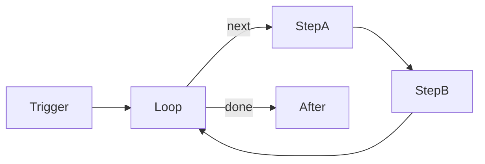
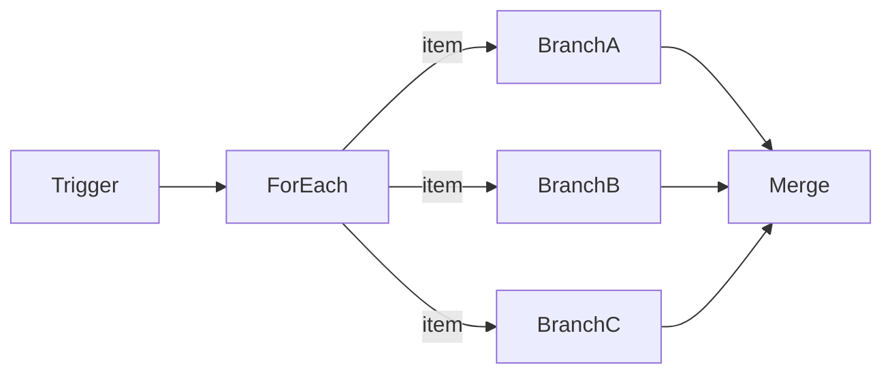

Looping in SuperPlane uses two components: **Loop** (repeat until a condition is met) and **For Each** (iterate over an array). This page explains how to use these components, their limits, and common looping patterns.

## Loop types at a glance

| Type | Component | When to use |
| --- | --- | --- |
| Condition-based | **Loop** | Polling, retries, pagination, or repeating a sequence until done. |
| Array iteration | **For Each** | Processing each item in a list independently (fan-out). |

## How Loop works

The Loop component creates a feedback cycle. It repeats a set of downstream steps until its **Until expression** evaluates to `true` or it reaches the maximum iteration limit.

The Loop component has two output channels:
- `next`: Emits an event to trigger the next iteration. Downstream nodes connect to this channel to form the loop body.
- `done`: Emits an event when the loop finishes (either because the condition was met, or it reached the maximum iteration limit).

When the loop body finishes executing, its final node wires back to the Loop component. The Loop evaluates the **Until expression** against the latest iteration's upstream outputs (using `$`). If the condition is met, the Loop emits on `done`. Otherwise, it emits on `next` again.

Because the Loop creates one long-lived **loop session** per run, concurrent triggers to the same Loop node are deferred until the active session completes.

## How For Each works

The For Each component evaluates an array expression and creates an independent execution branch for each item in the array. This is also known as a fan-out pattern.

Each item emitted by the For Each component carries a payload with:
- `item`: The array element for this branch.
- `index`: The zero-based index of the element.
- `totalCount`: The total number of items in the array.

If the array is empty, the For Each component passes without emitting any events to its downstream branches.

## Limits and failure modes

Both components have limits to prevent unbounded execution:

| Limit | Loop | For Each |
| --- | --- | --- |
| Iteration/item cap | 100 iterations (default 10) | 100 items |
| Timeout | 3600s default, fails run | N/A |
| Concurrency | 1 active session per node | Parallel branches |
| Delay | Optional between iterations | N/A |

When a Loop reaches its maximum iterations, it stops iterating and gracefully emits on `done` with a `stopReason` of `max_iterations`. If a Loop exceeds its wall-clock timeout (default 3600s), the entire run **fails** with a timeout error.

For Each is limited to 100 items per execution (configurable via environment variables). If the array exceeds this limit, the component errors before emitting any items.

## Accumulating results

SuperPlane loops do **not** natively accumulate outputs.
- A Loop's `done` payload contains only metadata about the execution (`iterations`, `stopReason`, `elapsedMs`), not the results of each iteration. The until expression `$` only sees the **current** iteration's outputs.
- A For Each emits completely independent branches that do not automatically aggregate.

To accumulate results, use dedicated state components:
- **Loop state**: Use [Memory](/concepts/canvas-memory) components (like Add Memory or Upsert Memory) within the loop body to collect items or track state across iterations.
- **For Each fan-in**: Use the [Merge](/components/core/#merge) component after the downstream branches. Merge waits for all upstream parallel branches to complete and combines their received event data.

## Nesting loops

You can nest looping components by combining them. They work by composition:

- **Loop inside For Each**: When a For Each branches out, putting a Loop inside the branch creates an independent loop session for each item (keyed by the root event).
- **Loop inside Loop**: The inner loop must complete and emit `done` before the outer loop evaluates its condition and continues.

Keep limits in mind when nesting. For example, a For Each that fans out to 10 branches, each running a Loop of 10 iterations, creates 100 executions. 

## Common patterns

- **Retry loop**: Loop → Action → Loop. Set the until expression to check if the action was successful (`$["action"].success`), up to the maximum iteration limit.
- **Poll until ready**: Loop → HTTP GET → Loop. Set the until expression to check the response status. Add a delay between iterations in the Loop configuration to avoid rate limits.
- **Fan-out / fan-in**: For Each → Process item → Merge. Process each array element in parallel and aggregate the results.
- **Batch processing**: Use For Each over small batches (≤100 items), or use Loop with pagination and Memory to process large datasets.
- **Pagination**: Loop → Fetch page → Store in Memory → Loop. Use the until expression to check if the API response indicates no more pages are available.

## Related reading

- [Data flow](/concepts/data-flow)
- [Expressions](/concepts/expressions)
- [Memory](/concepts/canvas-memory)
- Component reference: [Loop](/components/core/#loop), [For Each](/components/core/#for-each), and [Merge](/components/core/#merge)
