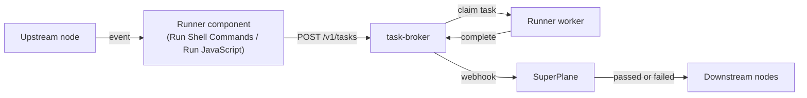

**Runners** are worker machines that execute custom workloads from your workflows. When a canvas node
needs to run shell commands or scripts outside SuperPlane, it sends the work to a runner fleet you select.

## How it works

Runner components are action nodes. They subscribe to upstream events, submit work to the task broker,
and wait for completion before emitting a payload downstream.

Each task carries the script or commands to run, an **execution mode** (host or Docker), environment
variables, and a webhook URL. SuperPlane also polls the broker as a fallback if a webhook is delayed.

Runners connect to the task broker, not to SuperPlane directly. That separation lets fleets scale,
change regions, or use disposable VMs without changing how workflows are modeled on the canvas.

## Machine types and fleets

Each runner belongs to a **fleet** — a homogeneous pool of machines with the same architecture and
capacity. On the canvas, you choose a fleet via **Machine type** (stored as `fleet_id` on the broker).

| Machine type | Fleet ID |
| ------------ | -------- |
| `e1-large-amd64` | `aws-standard-1` |
| `e1-large-arm64` | `aws-arm64-1` |
| `e1-tiny-amd64` | `e1-tiny-amd64` |
| `e1-tiny-arm64` | `e1-tiny-arm64` |

Pick a machine type that matches the architecture and size your workload needs. Fleets are registered
on the task broker before runners can claim work from them.

## Runner components

SuperPlane provides two core components that enqueue work on runners:

| Component | Key | What it runs |
| --------- | --- | ------------ |
| **Run Shell Commands** | `runner` | One or more shell commands (one per line) |
| **Run JavaScript** | `runnerJS` | A Node.js script with a `main()` function |

Both components share the same task lifecycle and output channels. See the [Core components](/components/core)
reference for field-level configuration.

### Run Shell Commands

Runs arbitrary shell on a fleet runner. Commands execute in order; the task succeeds when the last
command exits with code **0**.

- **Host mode**: Bash with a PTY on the runner machine.
- **Docker mode**: Commands run inside a container via `docker exec`. The runner pulls the image,
  starts a long-lived container, and executes your script. The image must include `sleep`.

### Run JavaScript

Runs a Node.js script on a fleet runner. Your script must define `function main()`. The runner injects
upstream canvas data as the global `$` object (same shape as workflow [expressions](/concepts/expressions)).
Return a JSON-serializable value from `main()`; it appears in the finished payload as **result**.

Optional **setup commands** run before the script in the same environment and working directory.

## Execution modes

Every runner task uses one of two execution modes:

| Mode | Where work runs | Notes |
| ---- | --------------- | ----- |
| **Host** | Directly on the runner machine | Default. Shell uses Bash with a PTY; scripts use Node.js on the host. |
| **Docker** | Inside a container on the runner | Pull image → start container → `docker exec` → stop. Choose a base image or enter a custom OCI reference. Private registries require registry credentials on the runner. |

Host and Docker behave differently for shell workloads. Host mode uses Bash with a TTY; Docker mode
bundles multi-line commands into a single `sh -c` script without a TTY. Prefer Docker when you need
an isolated environment or a specific toolchain image.

## Tasks, results, and routing

A **task** is one execution of a runner component node. When the task reaches a terminal state,
SuperPlane emits a `runner.finished` or `runnerJS.finished` payload and routes to an output channel:

| Channel | When |
| ------- | ---- |
| **Passed** | Task status is `succeeded` and exit code is **0** |
| **Failed** | Any other outcome, including non-zero exit code or cancellation |

### Structured results

Runner tasks can return structured JSON beyond exit codes. If the completed task includes valid JSON
in **result**, SuperPlane includes it on the finished event payload next to **status** and
**exit_code**. Downstream nodes can reference this data in expressions like any other payload field.

### Timeouts and cancellation

Set an optional **execution timeout** (1–86400 seconds; default **3600** when unset). You can cancel
a running task from the node sidebar or API; the cancel propagates through the broker to the runner.

### Logs

When CloudWatch logging is configured, task stdout and stderr stream to CloudWatch. You can follow live
logs from the run item details in the UI while a task is running.

## When to use runners

Use runner components when a workflow step needs code or shell that SuperPlane integrations do not cover:

- Run build scripts, linters, or custom tooling on dedicated machines
- Transform upstream payload data with JavaScript and pass structured output downstream
- Execute in a specific container image without managing SSH or long-lived hosts

For remote commands on a host you manage directly, consider [SSH Command](/components/core/#ssh-command)
instead. For HTTP or API calls, use [HTTP Request](/components/core/#http-request).

For more on how payloads flow between nodes, see [Data Flow](/concepts/data-flow). For expression
syntax inside runner scripts and node configuration, see [Expressions](/concepts/expressions).
