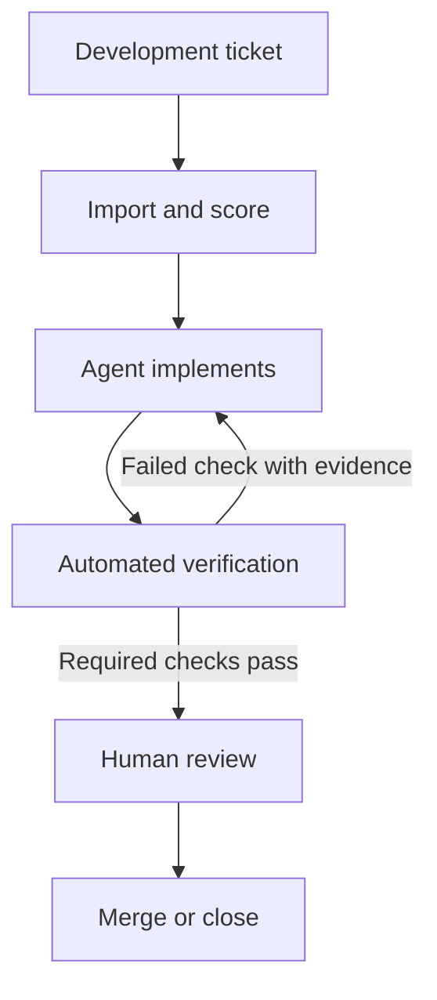

import { CardGrid, Icon, LinkCard, Tabs, TabItem } from "@astrojs/starlight/components";

SuperPlane is an **open source factory for one-shot engineering**. It turns high-confidence backlog issues into verified, review-ready pull requests.

SuperPlane coordinates coding agents, source control, CI, review, approvals and feedback in one workflow. Engineers can focus on work that needs judgment.

The factory finds routine work that agents can handle and applies consistent guardrails to every run. It returns failures with useful context.

<CardGrid>
  <LinkCard
    title="Quickstart"
    href="/get-started/quickstart"
    description="Create a workspace and connect your first GitHub repository."
  />
  <LinkCard
    title="How SuperPlane works"
    href="/get-started/how-superplane-works"
    description="Follow task intake, agent execution, verification and human review."
  />
  <LinkCard
    title="Build your first Factory"
    href="/get-started/build-first-factory"
    description="Run two GitHub issues through a Factory and deploy the resulting application."
  />
</CardGrid>

## What SuperPlane does

Connect a repository and configure the Factory to listen for matching development tickets. The intake automation imports each ticket and records a confidence score from the checks configured by your team. Treat the score as a routing signal, not a guarantee: it helps separate bounded work with an observable outcome from work that still needs clarification.

When your team starts a task, SuperPlane dispatches the configured coding agent on a runner. The implementation automation records the run, branch and pull request. The verification automation then evaluates required status checks and pull request feedback. A failed check can return to the agent with its output attached; a passing result proceeds to human review.

For example, an issue that says “Add the YouTube channel to the Community page” can specify the target page, URL, accessible label and required new-tab behavior. SuperPlane can import that issue, run the change, check the link and build and present the resulting pull request with its run history. A person reviews the final diff and decides whether to merge it.

<figure class="sp-media-figure not-content">
  <video aria-label="Introduction to the SuperPlane Factory workflow" controls playsinline preload="metadata" src="https://docs-assets.superplane.com/src/assets/introduction_demo.mp4">
    Your browser does not support embedded video. Use the written overview above instead.
  </video>
  <figcaption>A repository issue enters Backlog, moves through agent implementation and automated verification and reaches the team with its pull request and check results attached.</figcaption>
</figure>

### What you can do with SuperPlane

- **Import and assess development tickets:** Listen for matching work in connected trackers and record a confidence score before execution starts.
- **Run coding agents on configured compute:** Start an agent with the repository, task context, model, tools and runner settings defined by the Factory.
- **Apply the same verification on every run:** Evaluate CI status, repository checks and review feedback before the task reaches a person.
- **Connect your engineering stack:** Build automations with more than 400 integration components across source control, CI/CD, observability, incident response, cloud infrastructure and AI providers.
- **Route failures with evidence:** Attach command output, check results and pull request feedback to the next attempt instead of asking an engineer to reconstruct the failure.
- **Keep an execution record:** Track task state, automation runs, artifacts, cost and the final outcome in a shared workspace.

## The software factory adds a process around the agent

A coding agent can inspect a repository, edit files and run commands. The software factory decides when that agent runs, which context and compute it receives, which checks must pass and when the result needs a person.

The normal path has one human review after the required automated checks pass. The Factory can pause earlier when a task needs a product, security or scope decision, but those exceptions are not additional review stages in the standard path.

## Example: add a YouTube link from a GitHub issue

  <Tabs>
    <TabItem label="Task">
      
The GitHub issue asks for a YouTube logo and link in the Community section. The Factory records the request, its source and its expected result.

      <figure class="sp-media-figure">
        <video aria-label="Creating a Factory task" controls playsinline preload="metadata" src="https://docs-assets.superplane.com/src/assets/Plan_section_video.mp4">
          Your browser does not support embedded video.
        </video>
        <figcaption>Start with a clear piece of work.</figcaption>
      </figure>
    </TabItem>
    <TabItem label="Plan">
      
The Backlog automation inspects the issue and repository context, then records whether the task has a bounded scope and a usable verification path.

      <figure class="sp-media-figure">
        <video aria-label="Assessing a task in the Backlog automation" controls playsinline preload="metadata" src="https://docs-assets.superplane.com/src/assets/plan_video.mp4">
          Your browser does not support embedded video.
        </video>
        <figcaption>Assess the task before spending agent time on implementation.</figcaption>
      </figure>
    </TabItem>
    <TabItem label="Implement">
      
A configured runner launches the coding agent. The agent updates the Community page, commits the change and opens or updates the pull request.

      <figure class="sp-media-figure">
        <video aria-label="Implementing a task with a coding agent" controls playsinline preload="metadata" src="https://docs-assets.superplane.com/src/assets/implementation_video.mp4">
          Your browser does not support embedded video.
        </video>
        <figcaption>Run the implementation through the Factory's shared instructions.</figcaption>
      </figure>
    </TabItem>
    <TabItem label="Verify">
      
The Factory checks the build, link destination, new-tab behavior and accessible label. A failed check returns to the workflow with its output attached.

      <figure class="sp-media-figure">
        <video aria-label="Verifying an implemented task" controls playsinline preload="metadata" src="https://docs-assets.superplane.com/src/assets/verify_video.mp4">
          Your browser does not support embedded video.
        </video>
        <figcaption>Apply the same verification rules to every run.</figcaption>
      </figure>
    </TabItem>
    <TabItem label="Review / Done">
      
Your team receives the pull request with the task, run history and check results attached. A person reviews the final diff and decides whether to merge it.

      <figure class="sp-media-figure">
        <video aria-label="Reviewing a completed task" controls playsinline preload="metadata" src="https://docs-assets.superplane.com/src/assets/done_video.mp4">
          Your browser does not support embedded video.
        </video>
        <figcaption>Keep one human review at the end of the normal path.</figcaption>
      </figure>
    </TabItem>
  </Tabs>

The example is small, but the process is reusable. Its implementation and verification rules live in Factory automations, where the team can inspect and update them for future tasks.

## How a factory differs from an interactive coding agent

The distinction is not the model. A coding agent can run on a laptop or in a remote environment. SuperPlane adds the durable, team-level process around agent sessions.

  

    Concern
    Interactive coding agent session
    SuperPlane Factory
  

  <dl>
    

      <dt>Execution environment</dt>
      <dd><strong>Interactive coding agent session</strong>Runs on the developer's computer or a remote environment selected for that session. The developer usually starts and supervises it.</dd>
      <dd><strong>SuperPlane Factory</strong>Dispatches each task to configured runner capacity, including on-demand managed compute, without requiring a developer's workstation to stay online.</dd>
    

    

      <dt>Instructions</dt>
      <dd><strong>Interactive coding agent session</strong>Uses the prompt, checkout, tools and local configuration available in that session. Two developers can run the same task differently.</dd>
      <dd><strong>SuperPlane Factory</strong>Stores implementation and routing rules in shared automations so the team applies the same process across tasks and repositories.</dd>
    

    

      <dt>Verification</dt>
      <dd><strong>Interactive coding agent session</strong>Can run tests and inspect output, but the commands and response to failure depend on the session instructions.</dd>
      <dd><strong>SuperPlane Factory</strong>Runs the configured status checks, records their results and routes failures or review feedback back into the workflow before human review.</dd>
    

    

      <dt>Continuity</dt>
      <dd><strong>Interactive coding agent session</strong>Context and progress are commonly tied to one conversation and one working environment.</dd>
      <dd><strong>SuperPlane Factory</strong>Preserves task state, runs, artifacts, errors and pull requests in the workspace so another team member can inspect the same record.</dd>
    

    

      <dt>Responsibility</dt>
      <dd><strong>Interactive coding agent session</strong>Produces the code change requested in the session.</dd>
      <dd><strong>SuperPlane Factory</strong>Coordinates intake, agent execution, verification and escalation while leaving the final judgment with the team.</dd>
    

  </dl>

Read [How SuperPlane works](/get-started/how-superplane-works) to learn how SuperPlane applies this model.

## Need help? Share in the community

We would love to hear from you or help you get started. Use these channels to connect with the SuperPlane community.

  <a class="help-card" href="https://discord.superplane.com/" target="_blank" rel="noreferrer">
    <Icon name="discord" size="1.5rem" /><Icon name="external" size="0.9rem" />
    <strong>Join our Discord server</strong>
    Ask questions and get help from the SuperPlane community.
  </a>
  <a class="help-card" href="https://x.com/superplanehq" target="_blank" rel="noreferrer">
    <Icon name="x.com" size="1.5rem" /><Icon name="external" size="0.9rem" />
    <strong>Follow us on X</strong>
    Get the latest SuperPlane updates and announcements.
  </a>
  <a class="help-card" href="https://luma.com/superplane" target="_blank" rel="noreferrer">
    <Icon name="rocket" size="1.5rem" /><Icon name="external" size="0.9rem" />
    <strong>Join a SuperPlane event</strong>
    View upcoming events and register through the SuperPlane calendar.
  </a>
  <a class="help-card" href="https://github.com/superplanehq/superplane" target="_blank" rel="noreferrer">
    <Icon name="star" size="1.5rem" /><Icon name="external" size="0.9rem" />
    <strong>Give us a star on GitHub</strong>
    Visit the repository and star SuperPlane if you find it useful.
  </a>

