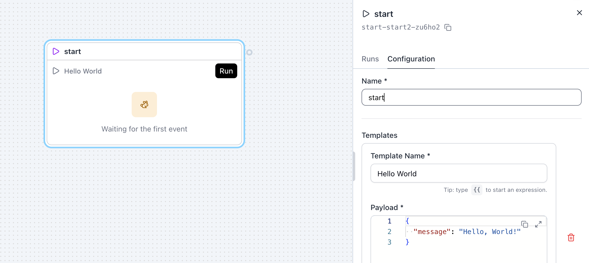
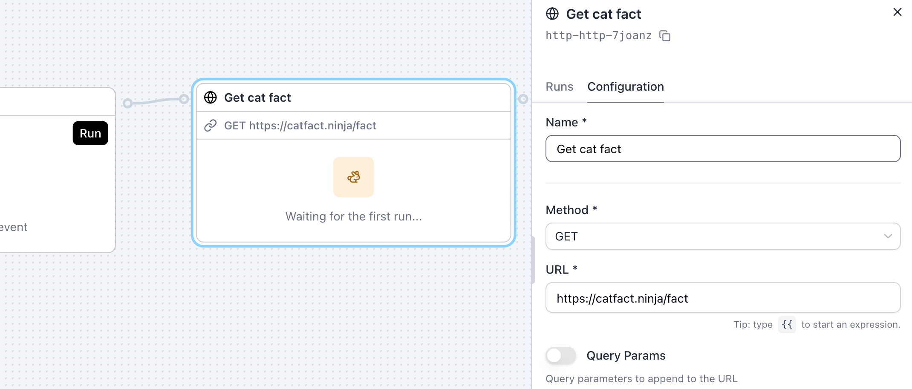
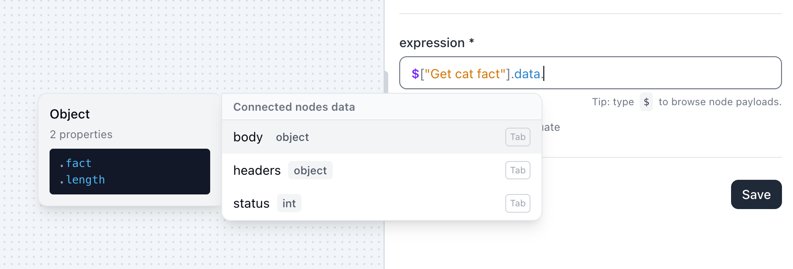
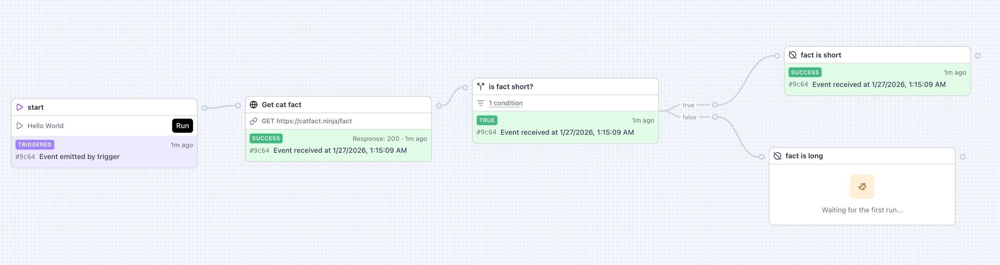
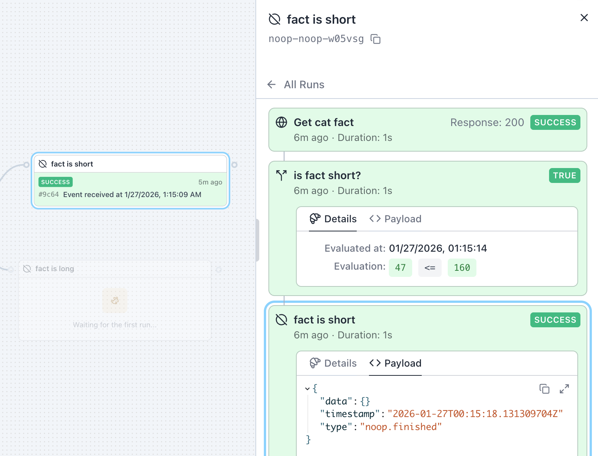

This quickstart guides you to your first "hello world" moment in SuperPlane: building a small workflow on
a **canvas**, running it, and inspecting the resulting **run**, **run items**, and **payloads**.

You won't need to connect any third-party services.

## What you’ll build

A tiny workflow that:

- starts from a **Manual Run**
- fetches a random cat fact via **HTTP Request**
- branches with **If** (True/False output channels) based on the length of the cat fact
- ends with one of the **No Operation** nodes

Along the way you’ll learn the core mental model: nodes emit payloads, downstream nodes subscribe, and
payloads accumulate into a **message chain** you can reference in expressions.

## Prerequisites

- You can access the SuperPlane UI.
- You can create or open a canvas in a project/workspace.

## Your first workflow (step-by-step)

### 1) Create a canvas

Create a new canvas and name it **Hello world**.

### 2) Add the trigger: Manual Run

1. Click **“+ Components”**.
2. Add **Manual Run** to the canvas.

When you drop it on the canvas, it will typically show up as a `start` node with a **Run** button. This is the trigger that will start the workflow.



### 3) Add an action: HTTP Request

1. Add **HTTP Request** to the canvas.
2. Connect **Manual Run → HTTP Request** (create a subscription).
3. Name the node **Get cat fact**.

Configure the HTTP Request:

- **Method**: `GET`
- **URL**: `https://catfact.ninja/fact`
- Click **Save** button at the bottom of the configuration panel.

Next, click **Run** button on the manual trigger node to run the first HTTP request. Further nodes will use the response from this run to help us write expressions.

This endpoint will fetch a random cat fact and return JSON like:

```json
{
  "fact": "A cat will tremble or shiver when it is in extreme pain.",
  "length": 56
}
```



### 4) Add branching: If

1. Add **If** to the canvas.
2. Connect **HTTP Request → If**.

For illustration purposes we will determine whether the cat fact can fit in an old-school tweet or not.

Set the If expression to branch based on the API response:

```
$['Get cat fact'].data.body.length <= 160
```

As you type the expression, you'll see that SuperPlane will provide you with a list of possible data attributes to choose from via autocompletion.



### 5) End both paths safely: No Operation

Add **two** No Operation nodes:

- Connect **If / True → No Operation** and name it `fact is short`.
- Connect **If / False → No Operation** and name it `fact is long`.

This keeps the tutorial completely safe: the workflow does real work (an HTTP call), but has no external
side effects.

### 6) Run it

1. Click the **Manual Run** node.
2. Click **Run**.

Run it a couple more times. You should see nodes update with statuses as each run item finishes.

Successfully running the workflow should look like this:



## Inspect a run (payloads, history, message chain)

You can inspect exactly what happened and what data flowed between nodes.

### 1) Open a run

1. Click the last node in your workflow (for example, your `Post short message` node).
2. In the sidebar, within the **Runs** tab, click the most recent event.

You’ll be taken to a run-focused view with:

- **This run was triggered by** (the root trigger, e.g. `start`)
- **Steps** (each node that executed in this run)



### 2) Explore steps (the run chain)

In **Steps**, click different nodes (e.g. `Get cat fact`, `if fact is short`, your No Operation node) to see
their details for this run.

### 3) Inspect payloads

For the **HTTP Request** step (your `Get cat fact` node), open **Payload** and look for:

- `data.status` (HTTP status code)
- `data.body.fact` (the cat fact)
- `data.body.length` (length of the fact)

For any step, you can also open **Details** to see metadata like the event type and when it was emitted.

### 4) Understand the message chain

As a run executes, each node’s output is added to a message chain. You can reference any upstream
node by name in expressions:

```
$['Get cat fact'].data.body.length
$['Get cat fact'].data.body.fact
```

For a deeper explanation, see [Data Flow](/concepts/data-flow) and [Expressions](/concepts/expressions).

## Troubleshooting

- **HTTP Request fails**: Open the HTTP Request run item payload and check `data.status` and `data.error`.
  Public APIs sometimes rate-limit; re-run after a minute if needed.
- **A node didn’t run**: Verify the subscription lines on the canvas (Manual Run → HTTP Request → If),
  and ensure the No Operation nodes are connected to the correct If output channels.

## Next steps

The "hello world" was not exactly a DevOps workflow, but it was a good way to get started with the fundamentals of SuperPlane.

In the next section, we'll explore some real-world use cases.