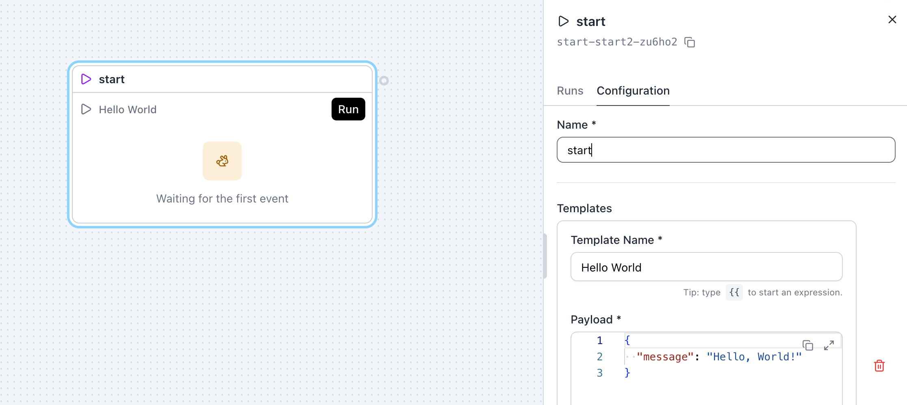
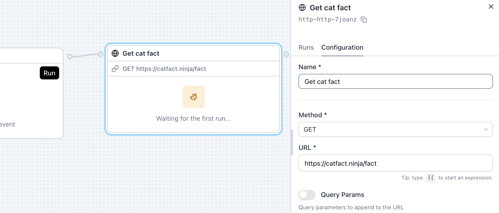
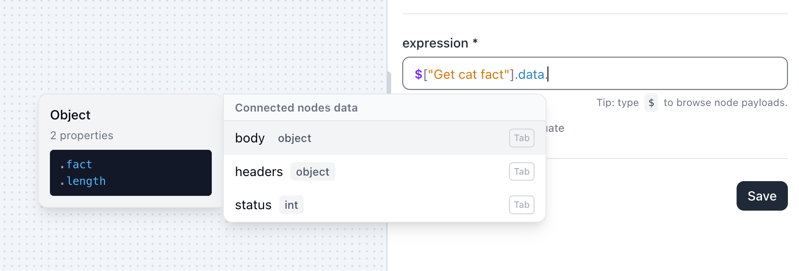
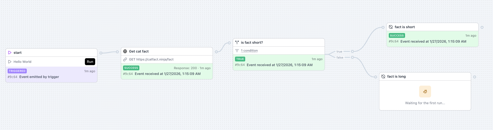
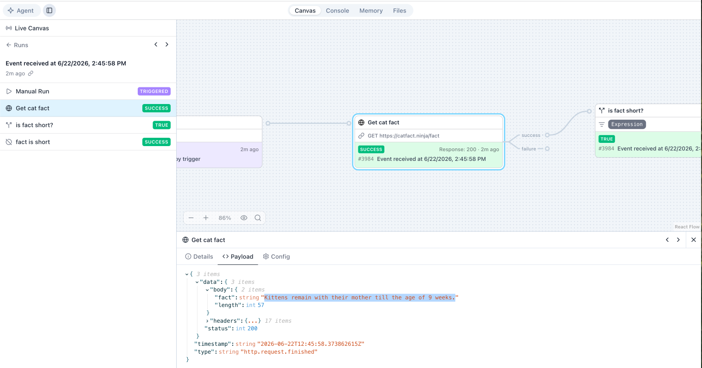

This quickstart guides you to your first "hello world" moment in SuperPlane: creating an **app**, building a small workflow on its **canvas**, running it, and inspecting the resulting **run** and **payloads**.

You won't need to connect any third-party services.

## What you'll build

A tiny workflow that:

- starts from a **Manual Run**
- fetches a random cat fact via **HTTP Request**
- branches with **If** (True/False output channels) based on the length of the cat fact
- ends with one of the **No Operation** nodes

Along the way you'll learn the core mental model: nodes emit payloads, downstream nodes subscribe, and
payloads accumulate into a **message chain** you can reference in expressions.

## Prerequisites

- You can access the SuperPlane UI.
- You have an organization where you can create apps.

## Your first workflow (step-by-step)

### 1) Create an app

Create a new app and name it **Hello world**. This opens the canvas where you build your workflow.

### 2) Add the trigger: Manual Run

1. Click **Edit** to enter edit mode.
2. Click **"+ Components"**.
3. Add **Manual Run** to the canvas.

When you drop it on the canvas, it will typically show up as a `start` node with a **Run** button. This is the trigger that will start the workflow.



### 3) Add an action: HTTP Request

1. Add **HTTP Request** to the canvas.
2. Connect **Manual Run → HTTP Request** by dragging from the output channel.
3. Name the node **Get cat fact**.

Configure the HTTP Request:

- **Method**: `GET`
- **URL**: `https://catfact.ninja/fact`
- Click **Save** button at the bottom of the configuration panel.

Next, publish your changes and click **Run** on the manual trigger node to run the first HTTP request. Further nodes will use the response from this run to help us write expressions.

This endpoint will fetch a random cat fact and return JSON like:

```json
{
  "fact": "A cat will tremble or shiver when it is in extreme pain.",
  "length": 56
}
```



### 4) Add branching: If

1. Add **If** to the canvas.
2. Connect **HTTP Request → If**.

For illustration purposes we will determine whether the cat fact can fit in an old-school tweet or not.

Set the If expression to branch based on the API response. The If field is a condition - write it without `{{ }}`:

```
$['Get cat fact'].data.body.length <= 160
```

As you type the expression, you'll see that SuperPlane will provide you with a list of possible data attributes to choose from via autocompletion.



### 5) End both paths safely: No Operation

Add **two** No Operation nodes:

- Connect **If / True → No Operation** and name it `fact is short`.
- Connect **If / False → No Operation** and name it `fact is long`.

This keeps the tutorial completely safe: the workflow does real work (an HTTP call), but has no external
side effects.

### 6) Publish and run

1. Click **Publish** to make your changes live.
2. Click the **Manual Run** node.
3. Click **Run**.

Run it a couple more times. You should see nodes update with statuses as each run finishes.

Successfully running the workflow should look like this:



## Inspect a run (payloads, history, message chain)

You can inspect exactly what happened and what data flowed between nodes.

### 1) Open a run

1. Open the **Runs** sidebar from the canvas header.
2. Click the most recent run to select it.

The canvas highlights the path the run took. The sidebar shows every node that executed, with its result.



### 2) Inspect a node

Click on any node in the run — either in the sidebar or directly on the canvas. A bottom panel opens with three tabs:

- **Details** — execution summary: status, timestamps, and result.
- **Payload** — the data this node emitted. For your `Get cat fact` node, look for `data.body.fact` and `data.body.length`.
- **Config** — the node's resolved settings at execution time.

### 3) Understand the message chain

Each node's output is added to a message chain. Reference upstream data with `$['Node Name'].field`. See [Expressions](/concepts/expressions).

For a deeper explanation, see [Data Flow](/concepts/data-flow) and [Expressions](/concepts/expressions).

## Troubleshooting

- **HTTP Request fails**: Open the HTTP Request run item payload and check `data.status` and `data.error`.
  Public APIs sometimes rate-limit; re-run after a minute if needed.
- **A node didn't run**: Verify the subscription lines on the canvas (Manual Run → HTTP Request → If),
  and ensure the No Operation nodes are connected to the correct If output channels.

## Next steps

The hello world was not exactly a DevOps workflow, but it covered the fundamentals: apps, canvases, nodes, runs, and payloads.

Browse [example apps](/concepts/sharing-apps#examples) for real-world workflows you can install and adapt.