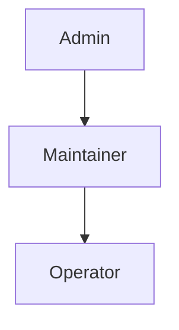
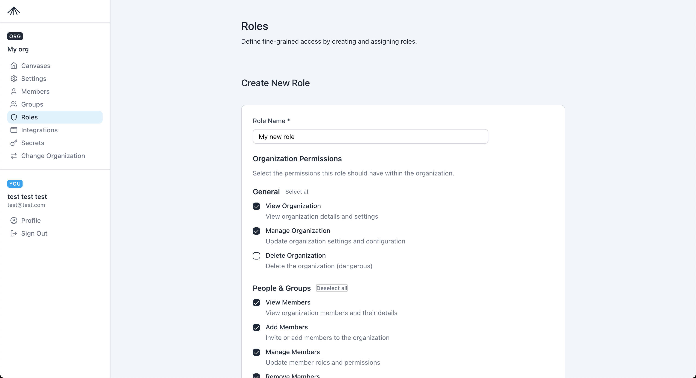
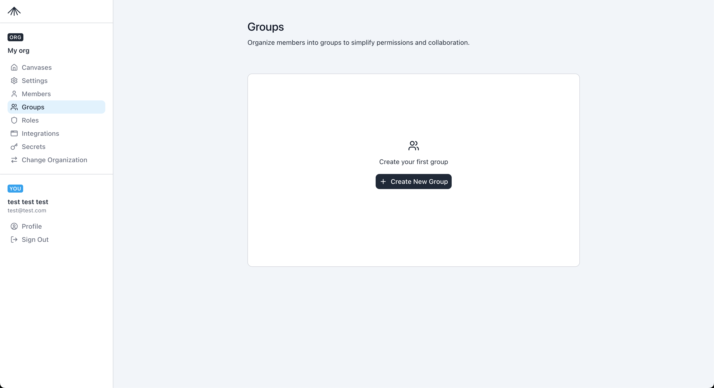
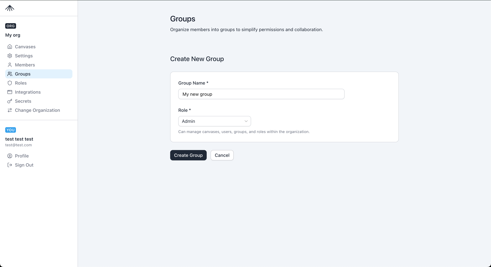

This page explains organization-scoped role-based access control (RBAC) in SuperPlane: who can do what, how roles stack, and how you assign access with roles, groups, and members.

SuperPlane evaluates permissions at the organization level. Roles are `Admin`, `Maintainer`, and `Operator`. Owner is a membership flag, not a role.

## Role model

- A member has one direct organization role at a time. Assigning a new role replaces the previous direct role.
- Group membership can add additional roles. Effective permissions are the union of the direct role, group roles, and inherited roles.
- Default roles are `Admin`, `Maintainer`, and `Operator`. They are read-only in the UI.
- To change the permissions of a default role, create a custom role and assign it instead.

## Role inheritance

`Admin` inherits `Maintainer`, and `Maintainer` inherits `Operator`. An Admin can do everything a Maintainer or Operator can do.

## Default roles

| Role | Inherits | Summary |
| --- | --- | --- |
| Admin | Maintainer | All Maintainer permissions, plus organization settings and deletion. |
| Maintainer | Operator | Manage members, groups, roles, [canvases](/concepts/canvas), integrations, secrets, and API keys. |
| Operator | — | Read-only access to organization settings, roles, groups, members, canvases, and API keys. |

New members are assigned the `Operator` role by default.

## Owner membership

Owner is a flag on the organization membership. It is not a role. It does not appear in the Roles list, and it is not part of the inheritance chain. The Members page shows it as a badge.

- API keys cannot be owners. Ownership is for human members only. See [API keys](/security/api-keys).
- You must keep at least one owner in the organization.

## Default role permissions

Operator permissions:

- `org.read`
- `roles.read`
- `groups.read`
- `members.read`
- `canvases.read`
- `api_keys.read`
- `agents.read`

Maintainer permissions:

- All Operator permissions.
- `canvases.create`
- `canvases.update`
- `canvases.delete`
- `members.create`
- `members.update`
- `members.delete`
- `groups.create`
- `groups.update`
- `groups.delete`
- `integrations.create`
- `integrations.read`
- `integrations.update`
- `integrations.delete`
- `secrets.create`
- `secrets.read`
- `secrets.update`
- `secrets.delete`
- `roles.create`
- `roles.update`
- `roles.delete`
- `api_keys.create`
- `api_keys.update`
- `api_keys.delete`
- `agents.create`

Admin permissions:

- All Maintainer permissions.
- `org.update`
- `org.delete`

## Roles

Use **Organization Settings > Roles** to review roles and create custom roles.

- Default roles are marked **Default Role** and are read-only.
- Custom roles can be created, edited, and deleted if you have `roles.*` permissions.

The Create Role page lets you pick permissions by category.

## Groups

Groups map to a single role. When you add a user to a group, they inherit that role in addition to any direct role assignment.

- Create groups in **Organization Settings > Groups**.
- Change a group role from the Groups list; all group members inherit the new role immediately.

## Members

The Members page is where you assign a member's direct role and manage invite links.

- New members start as `Operator` by default.
- Assigning a role replaces the previous direct role.
- Owners appear with an **Owner** badge. You must keep at least one owner in the organization.

## Permissions reference

Permissions are resource/action pairs (for example, `members.create`). Use this list when you build custom roles.

### General

- `org.read` — View organization details and settings.
- `org.update` — Update organization settings and configuration.
- `org.delete` — Delete the organization.

**Warning:** `org.delete` removes the organization.

### People and groups

- `members.read` — View organization members and their details.
- `members.create` — Invite or add members to the organization.
- `members.update` — Update member roles and permissions.
- `members.delete` — Remove members from the organization.
- `groups.read` — View organization groups and their members.
- `groups.create` — Create new groups within the organization.
- `groups.update` — Update group settings and membership.
- `groups.delete` — Delete groups from the organization.

### Roles and permissions

- `roles.read` — View organization roles and their permissions.
- `roles.create` — Create new roles within the organization.
- `roles.update` — Update role permissions and settings.
- `roles.delete` — Delete roles from the organization.

### Canvases

- `canvases.read` — View organization canvases.
- `canvases.create` — Create new canvases within the organization.
- `canvases.update` — Update canvas settings and configuration.
- `canvases.delete` — Delete canvases from the organization.

### Integrations

- `integrations.read` — View organization integrations.
- `integrations.create` — Create new integrations.
- `integrations.update` — Update integration settings and configuration.
- `integrations.delete` — Delete integrations from the organization.

### Secrets

- `secrets.read` — View organization secrets.
- `secrets.create` — Create new secrets.
- `secrets.update` — Update secrets.
- `secrets.delete` — Delete secrets from the organization.

### API keys

- `api_keys.read` — View API keys (not secret token values).
- `api_keys.create` — Create API keys.
- `api_keys.update` — Update API keys and rotate tokens.
- `api_keys.delete` — Delete API keys.

### Agents

- `agents.read` — View agent chats and messages.
- `agents.create` — Start or resume agent chats.
